Homework \#2
================
Kaitlyn Harper
September 18, 2017

-   [Bring rectangular data in](#bring-rectangular-data-in)
-   ["Smell test" the data](#smell-test-the-data)
-   [Explore individual variables](#explore-individual-variables)
-   [Explore various plot types](#explore-various-plot-types)
    -   [Two continuous variables](#two-continuous-variables)
    -   [One qualitative variable](#one-qualitative-variable)
    -   [One qual + one quant variable](#one-qual-one-quant-variable)
-   [Use filter, select, and pipes!](#use-filter-select-and-pipes)
-   [More, more, more!](#more-more-more)
-   [Reflection](#reflection)

Bring rectangular data in
-------------------------

``` r
# Load tidyverse + all corresponding packages!
library(tidyverse)
```

    ## Loading tidyverse: ggplot2
    ## Loading tidyverse: tibble
    ## Loading tidyverse: tidyr
    ## Loading tidyverse: readr
    ## Loading tidyverse: purrr
    ## Loading tidyverse: dplyr

    ## Conflicts with tidy packages ----------------------------------------------

    ## filter(): dplyr, stats
    ## lag():    dplyr, stats

``` r
# Load gapminder dataset
library(gapminder)
data("gapminder")

#View data (just to make sure it's there)
head(gapminder)
```

    ## # A tibble: 6 x 6
    ##       country continent  year lifeExp      pop gdpPercap
    ##        <fctr>    <fctr> <int>   <dbl>    <int>     <dbl>
    ## 1 Afghanistan      Asia  1952  28.801  8425333  779.4453
    ## 2 Afghanistan      Asia  1957  30.332  9240934  820.8530
    ## 3 Afghanistan      Asia  1962  31.997 10267083  853.1007
    ## 4 Afghanistan      Asia  1967  34.020 11537966  836.1971
    ## 5 Afghanistan      Asia  1972  36.088 13079460  739.9811
    ## 6 Afghanistan      Asia  1977  38.438 14880372  786.1134

<a href="#top">Back to top</a>

"Smell test" the data
---------------------

**Q1: Is it a data.frame, a matrix, a vector, a list?** **Q2: What’s its class?**

``` r
typeof(gapminder) #you can check the type of data with this
```

    ## [1] "list"

``` r
class(gapminder) #this is another easy way to check the class of data
```

    ## [1] "tbl_df"     "tbl"        "data.frame"

The type of object is a list, but it has three official classes: *data frame tbl, tbl,* and *data frame*.

**Q3: How many variables/columns?** **Q4: How many rows/observations?**

``` r
ncol(gapminder) # You can do this to check the number of columns
```

    ## [1] 6

``` r
nrow(gapminder) # Plus this checks the number of rows
```

    ## [1] 1704

``` r
dim(gapminder) # Or just do this! It will tell you both! 
```

    ## [1] 1704    6

There are 6 variables/columns and 1704 rows in this data set.

**Q5: Can you get these facts about “extent” or “size” in more than one way? Can you imagine different functions being useful in different contexts?**
Let's take a "glimpse" at the data! :)

``` r
glimpse(gapminder) # a helpful function for looking at extent/size
```

    ## Observations: 1,704
    ## Variables: 6
    ## $ country   <fctr> Afghanistan, Afghanistan, Afghanistan, Afghanistan,...
    ## $ continent <fctr> Asia, Asia, Asia, Asia, Asia, Asia, Asia, Asia, Asi...
    ## $ year      <int> 1952, 1957, 1962, 1967, 1972, 1977, 1982, 1987, 1992...
    ## $ lifeExp   <dbl> 28.801, 30.332, 31.997, 34.020, 36.088, 38.438, 39.8...
    ## $ pop       <int> 8425333, 9240934, 10267083, 11537966, 13079460, 1488...
    ## $ gdpPercap <dbl> 779.4453, 820.8530, 853.1007, 836.1971, 739.9811, 78...

``` r
str(gapminder) # this is another function for looking at extent/size
```

    ## Classes 'tbl_df', 'tbl' and 'data.frame':    1704 obs. of  6 variables:
    ##  $ country  : Factor w/ 142 levels "Afghanistan",..: 1 1 1 1 1 1 1 1 1 1 ...
    ##  $ continent: Factor w/ 5 levels "Africa","Americas",..: 3 3 3 3 3 3 3 3 3 3 ...
    ##  $ year     : int  1952 1957 1962 1967 1972 1977 1982 1987 1992 1997 ...
    ##  $ lifeExp  : num  28.8 30.3 32 34 36.1 ...
    ##  $ pop      : int  8425333 9240934 10267083 11537966 13079460 14880372 12881816 13867957 16317921 22227415 ...
    ##  $ gdpPercap: num  779 821 853 836 740 ...

One way you could get these dimensions (and a bunch of other info about the data set) is by using the glimpse or str functions. These function provide the class of each variable, the number of different values for factor variables, and the first few rows for each variable. This could be helpful when you want to find out more info with fewer clicks, and it can also help us answer the next question! :)

**Q6: What flavor is each variable?**
To check the "flavor", I looked at the class of each variable. Check out my original [Rmd file](https://github.com/oktokat/STAT545-hw-harper-kaitlyn/blob/master/hw02/hw02.Rmd) to see how I inserted code into this paragraph!! The country and continent variables are **factors**; the year and pop variables are **integers**; the lifeExp and gdpPercap variables are **numeric**.

<a href="#top">Back to top</a>

Explore individual variables
----------------------------

**Pick at least one categorical variable and at least one quantitative variable to explore.**
I will explore the country variable and the life expectancy variable.

**Characterize what’s possible, i.e. all possible values or max vs. min … whatever’s appropriate.**

``` r
# Qualitative variable: country
head(unique(gapminder$country)) # shows the unique values within the country variable (only showing the first six)
```

    ## [1] Afghanistan Albania     Algeria     Angola      Argentina   Australia  
    ## 142 Levels: Afghanistan Albania Algeria Angola Argentina ... Zimbabwe

``` r
length(unique(gapminder$country)) # number of unique values within the country variable
```

    ## [1] 142

``` r
head(table(gapminder$country)) # number of rows for each country (only showing first six)
```

    ## 
    ## Afghanistan     Albania     Algeria      Angola   Argentina   Australia 
    ##          12          12          12          12          12          12

``` r
numCountries = table(gapminder$continent)/(table(gapminder$country)[1]) # number of countries within each continent

# Quantitative variable: life expectancy 
summary(gapminder$lifeExp) # provides a simple statistical summary of the variable
```

    ##    Min. 1st Qu.  Median    Mean 3rd Qu.    Max. 
    ##   23.60   48.20   60.71   59.47   70.85   82.60

``` r
length(unique(round(gapminder$lifeExp, 1))) # provides the number of unique life expectancies for all rows (note: I rounded the numbers to provide a more general statistic)
```

    ## [1] 468

*Qualitative variable: country*
There are 142 unique countries in this data set. There are 195 countries in the world, so this data set is missing 53 countries. Each country contains 12 rows, or 12 different points in time. There are 5 continents represented in this data set. There are 52 countries represented from Africa, 25 countries represented from the Americas, 33 countries represented from Asia, 30 countries represented from Europe, and 2 countries represented from Oceania

*Quantitative variable: life expectancy*
First, we'll look at the life expectancy variable as a whole. The minimum life expectancy from all countries, all years was 23.6 and the maximum life expectancy was 82.6. The mean life expectancy was 59.47. However, this isn't all that helpful to us, because there are multiple countries and multiple time points measured. A bit later, we'll break up some of the countries and time points and get a better look!

**What’s typical? What’s the spread? What’s the distribution? Etc., tailored to the variable at hand.**

``` r
# Plot the life expectancy of each country
gapminder %>%                                                 # pipe in data set
  ggplot(aes(country, lifeExp)) +                             # insert general aesthetics 
  geom_point() +                                              # add points
  theme(axis.text.x = element_text(angle = 90, hjust = 1)) +  # arrange text vertically
  ylab("life expectancy (years)") +                           # add y-axis label
  ggtitle("Life expectancy of each country from 1952-2007")   # add title
```

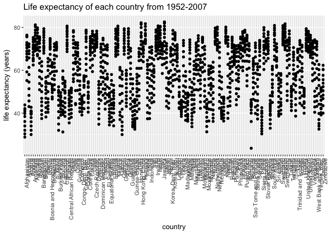

Looks like the distribution of life expectancies varies a LOT between countries and also within the same country! Check out the plots below to get a better feel for the data!

<a href="#top">Back to top</a>

Explore various plot types
--------------------------

Here are a few different plots using all the data (no filtering/grouping yet)

### Two continuous variables

``` r
# Create an object with the data/aesthetics
a = ggplot(gapminder, aes(x= year, y = lifeExp))

# Plot life expectancy with unadjusted abline
a + geom_point() + 
  labs(title = "A look at life expectancy over the years 1952-2007, unadjusted", y = "life expectancy (years)") + stat_smooth(method="lm", se=FALSE, color = "lightblue", size = 2)
```

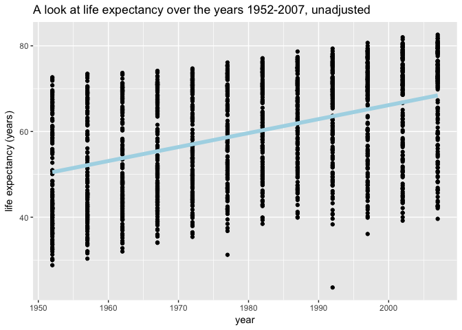

``` r
# Use linear regression to adjust for gdp per capita
reg = lm(gapminder$lifeExp ~ gapminder$year + gapminder$gdpPercap)
summary(reg)
```

    ## 
    ## Call:
    ## lm(formula = gapminder$lifeExp ~ gapminder$year + gapminder$gdpPercap)
    ## 
    ## Residuals:
    ##     Min      1Q  Median      3Q     Max 
    ## -67.262  -6.954   1.219   7.759  19.553 
    ## 
    ## Coefficients:
    ##                       Estimate Std. Error t value Pr(>|t|)    
    ## (Intercept)         -4.184e+02  2.762e+01  -15.15   <2e-16 ***
    ## gapminder$year       2.390e-01  1.397e-02   17.11   <2e-16 ***
    ## gapminder$gdpPercap  6.697e-04  2.447e-05   27.37   <2e-16 ***
    ## ---
    ## Signif. codes:  0 '***' 0.001 '**' 0.01 '*' 0.05 '.' 0.1 ' ' 1
    ## 
    ## Residual standard error: 9.694 on 1701 degrees of freedom
    ## Multiple R-squared:  0.4375, Adjusted R-squared:  0.4368 
    ## F-statistic: 661.4 on 2 and 1701 DF,  p-value: < 2.2e-16

``` r
coeffs = coefficients(reg)

# Plot life expectancy with abline, adjusted for GDP per capita
a + geom_point() + 
  labs(title = "A look at life expectancy over the years 1952-2007, adjusted for GDP per capita", y = "life expectancy (years)") + geom_abline(intercept = coeffs[1], slope = coeffs[2], color = "plum", size = 2)
```

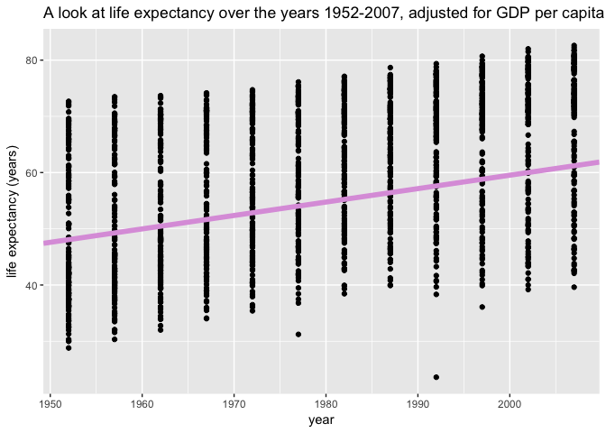

### One qualitative variable

``` r
# Histogram of the distribution of life expectancies
ggplot(gapminder, aes(lifeExp)) +
  geom_histogram(binwidth = 2) +
  labs(y = "Count", x = "Life expectancy (years)", title= "Distribution of life expectancies")
```

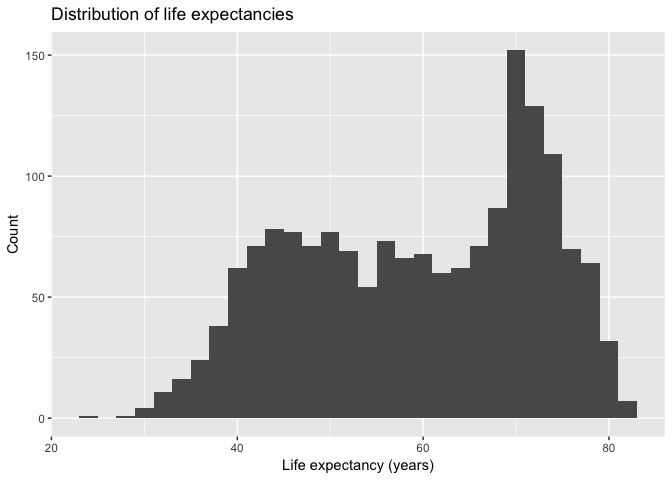

``` r
# Barplot of the number of country observations within each continent
ggplot(gapminder, aes(continent)) +
  geom_bar() +
  ggtitle("Number of observations per continent")
```

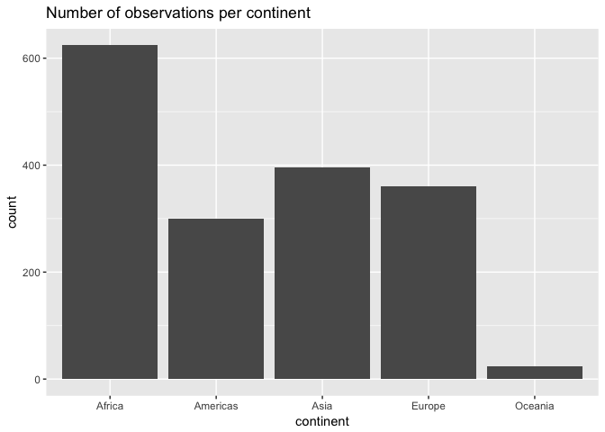

### One qual + one quant variable

``` r
# Filter out the data for 2007
gapminder2007 = gapminder %>% 
                  filter(year == 2007)

# Plot gdp per capita for 2007, all countries grouped by continent
ggplot(gapminder2007, aes(continent, gdpPercap)) + 
  stat_boxplot() +
  ggtitle("GDP per capita for each continent in 2007")
```

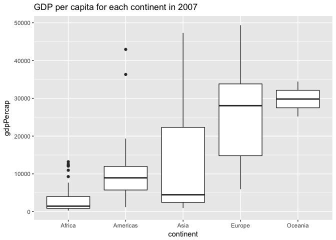

``` r
rm(gapminder2007) #clean up environment
```

Cool! We can see the plot of data from 2007 above, so let's work off of that and see if we can compare each year.

``` r
length(unique(gapminder$year)) # there are 12 different years measured in these data
```

    ## [1] 12

``` r
gapminder %>% 
  ggplot(aes(x=continent, y=gdpPercap)) +                   # pipe in data and aes
  stat_boxplot() +                                          # add boxplot
  facet_wrap(~ year) +                                      # plot in panels separated by year
  theme(axis.text.x = element_text(angle = 90, hjust = 1))  # arrange y-axis text vertically
```

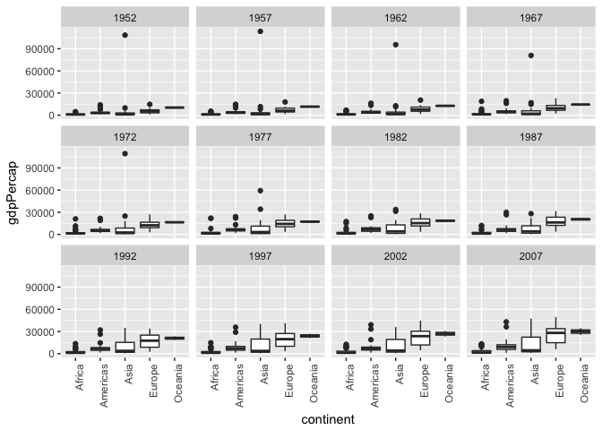

Looks like the gdp per capita increases over the years and also becomes much more variable, especially in Asia and Europe. Interesting!

<a href="#top">Back to top</a>

Use filter, select, and pipes!
------------------------------

``` r
# Plot the GDP of all countries (minus Oceania) in 1952 and 2007 
gapminder %>% 
  filter(continent != "Oceania", year == 1952 | year == 2007) %>%                      # filter out Oceania, keep only 1952 and 2007
  ggplot(aes(x=continent, y=gdpPercap)) +                                              # add ggplot aes
    stat_boxplot(alpha=1/2, size = 1, aes(color=continent), show.legend = FALSE) +     # color the boxes by continent plus adjust the transparency and size; don't show legend
    facet_wrap(~ year) +                                                               # separate panels by year
    theme(axis.text.x = element_text(angle = 90, hjust = 1)) +                         # adjust text to be vertical
    ggtitle("GDP per capita by continent (1952 vs. 2007)")                             # add title
```

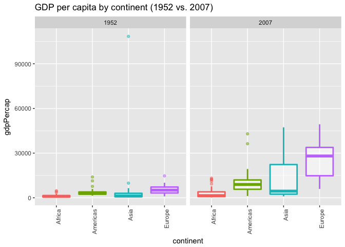

``` r
# Add each individual country with "jitter"
# "jitter" adds the points onto the plot, but with a tiny bit of error so they're spread out and easier to see!
gapminder %>% 
  filter(continent != "Oceania", year == 1952 | year == 2007) %>% 
  ggplot(aes(x=continent, y=gdpPercap)) +
    stat_boxplot(alpha=1/2, size = 1, aes(color=continent), show.legend = FALSE) +
    geom_jitter() + 
    facet_wrap(~ year) +
    theme(axis.text.x = element_text(angle = 90, hjust = 1)) + 
    ggtitle("GDP per capita by continent (1952 vs. 2007)")
```

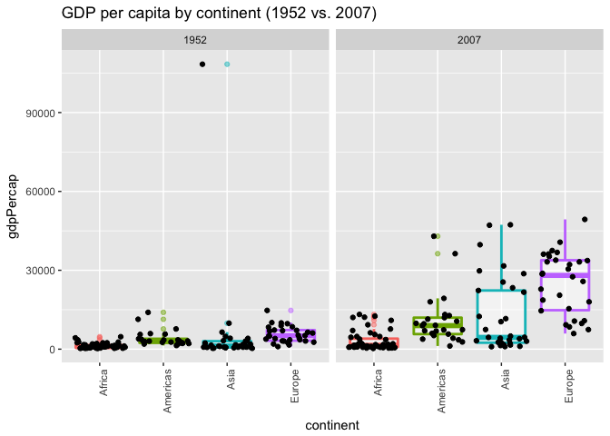

``` r
asia = gapminder %>% 
  filter(continent == "Asia", year == 2007) %>%                 # filter only Asia in 2007
  select(country, lifeExp, gdpPercap, pop) %>%                  # remove year and continent
  arrange(gdpPercap) %>%                                        # arrange from smallest to largest GDP
  mutate(gdpGroup = factor(cut(gdpPercap, quantile(gdpPercap), include.lowest= TRUE), labels = c("low", "low-middle", "middle-high", "high"))) 
                                                                # split gdp into four quantiles

# plot life expectancy by gdp group
ggplot(asia, aes(gdpPercap, lifeExp)) +
  geom_point(alpha=3/4, size=3, aes(color=country)) +
  facet_wrap(~ gdpGroup) +
  theme(axis.text.x = element_text(angle = 90, hjust = 1)) +
  ggtitle("Life expectancy of Asian countries in 2007, grouped by GDP per capita")
```

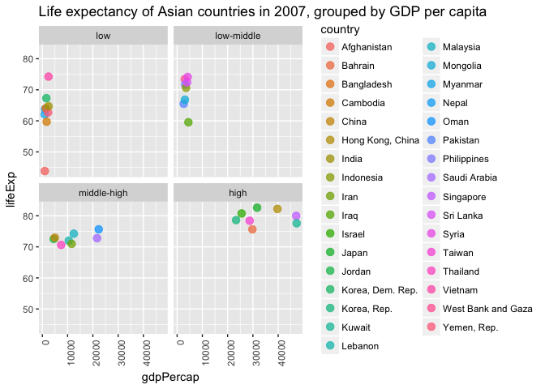

``` r
rm(asia) # cleanup environment
```

Let's explore some common factors in countries that lie below the life expectancy mean. We'll look at only data from 2007.

``` r
# Create a new variable mutate
gap_mean = gapminder %>%
  mutate(LEgroup = ifelse(test = (gdpPercap < mean(gdpPercap)), yes = "low", no = "high")) %>%    #create new variable that keeps only the gdp's below the mean gdp
  filter(year == 2007) %>%                       # keep only data from 2007
  select(-year)                                  # get rid of the year variable (it's obsolete now)

head(gap_mean) # Countries now are classified as having "high" or "low" life expectancy
```

    ## # A tibble: 6 x 6
    ##       country continent lifeExp      pop  gdpPercap LEgroup
    ##        <fctr>    <fctr>   <dbl>    <int>      <dbl>   <chr>
    ## 1 Afghanistan      Asia  43.828 31889923   974.5803     low
    ## 2     Albania    Europe  76.423  3600523  5937.0295     low
    ## 3     Algeria    Africa  72.301 33333216  6223.3675     low
    ## 4      Angola    Africa  42.731 12420476  4797.2313     low
    ## 5   Argentina  Americas  75.320 40301927 12779.3796    high
    ## 6   Australia   Oceania  81.235 20434176 34435.3674    high

``` r
# histogram of GDP
gap_mean %>% 
  ggplot(aes(gdpPercap)) +
  geom_density() + 
  facet_wrap(~ LEgroup) +
  ggtitle("Distribution of countries by GDP per capita in 2007")
```

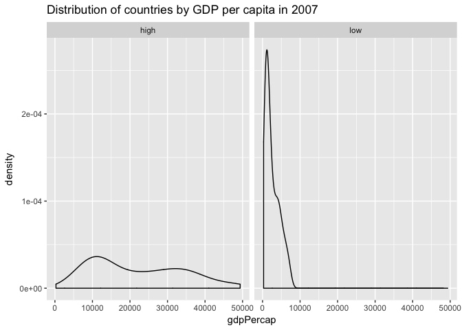

``` r
# histogram of population
gap_mean %>% 
  ggplot(aes(pop)) +
  geom_density() +
  facet_wrap(~ LEgroup) +
  ggtitle("Distribution of countries by population in 2007")
```

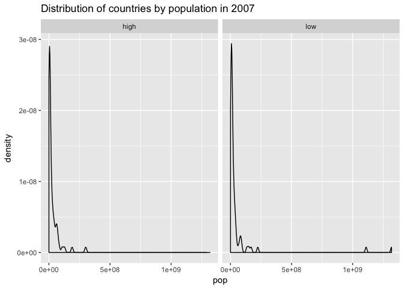

Hmmm... what are those outliers in the "low life expectancy" group? Let's check them out...

``` r
# find the two outliers
justLOW = gap_mean %>% 
  filter(LEgroup != "high") %>%     # keep only rows that have "high LE"
  arrange(desc(pop))                # arrange them in descending order to see which ones are the highest outliers

# replot population histogram without outliers
gap_mean %>%
  filter(country != "China" & country != "India") %>%    # remove China and India
  ggplot(aes(pop)) +
  geom_density() +
  facet_wrap(~ LEgroup) +
  ggtitle("Distribution of countries by population (China and India removed) in 2007")
```

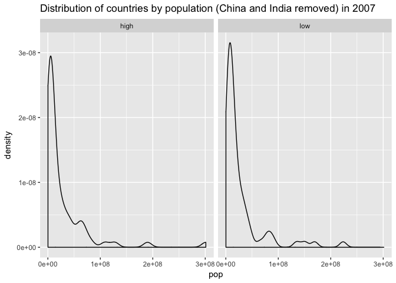

``` r
rm(justLOW) #clean up
```

Huh, without those outliers the histograms actually seem pretty similar!

``` r
# Barplot of countries in each continent, separated by LEgroup
gap_mean %>% 
  ggplot(aes(continent)) +
  geom_bar() +
  facet_wrap(~ LEgroup) +
  ggtitle("Number of countries within each continent in 2007, separated by low and high \nlife expectancies")
```

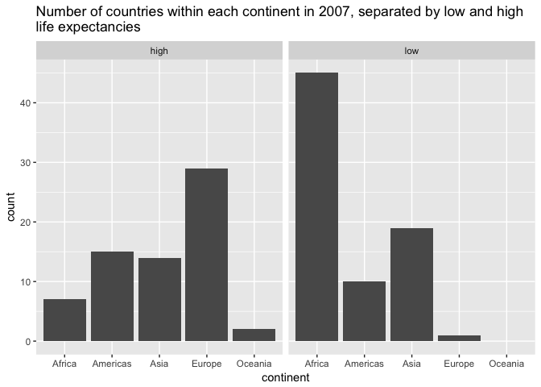

``` r
rm(gap_mean)
```

Check that out - there are no countries in Oceania that have a low life expectancy! Also, not surprisingly, the highest number of "low LE" countries are in Africa; the highest number of "high LE" countries are in Europe.

<a href="#top">Back to top</a>

More, more, more!
-----------------

``` r
# what's wrong with this? see below for answer!
new_gap = filter(gapminder, country == c("Rwanda", "Afghanistan"))

new_gap  
```

    ## # A tibble: 12 x 6
    ##        country continent  year lifeExp      pop gdpPercap
    ##         <fctr>    <fctr> <int>   <dbl>    <int>     <dbl>
    ##  1 Afghanistan      Asia  1957  30.332  9240934  820.8530
    ##  2 Afghanistan      Asia  1967  34.020 11537966  836.1971
    ##  3 Afghanistan      Asia  1977  38.438 14880372  786.1134
    ##  4 Afghanistan      Asia  1987  40.822 13867957  852.3959
    ##  5 Afghanistan      Asia  1997  41.763 22227415  635.3414
    ##  6 Afghanistan      Asia  2007  43.828 31889923  974.5803
    ##  7      Rwanda    Africa  1952  40.000  2534927  493.3239
    ##  8      Rwanda    Africa  1962  43.000  3051242  597.4731
    ##  9      Rwanda    Africa  1972  44.600  3992121  590.5807
    ## 10      Rwanda    Africa  1982  46.218  5507565  881.5706
    ## 11      Rwanda    Africa  1992  23.599  7290203  737.0686
    ## 12      Rwanda    Africa  2002  43.413  7852401  785.6538

Oops! Nope, the analyst did *not* succeed in extracting all the data from Rwanda and Afghanistan. This function actually only extracted HALF of the data from each country? Why?? This was a little confusing at first, but after checking out the data, we can see that this filters the data in a pattern: first Rwanda, then Afghanistan, repeated over and over. That's because **country == c("Rwanda", "Afghanistan"))** tells filter function will go through that pattern as many times as possible until the end of the data. Here's the proper way to do it:

``` r
# using the "or" argument
new_gap2 = filter(gapminder, country == "Rwanda" | country == "Afghanistan")

new_gap2
```

    ## # A tibble: 24 x 6
    ##        country continent  year lifeExp      pop gdpPercap
    ##         <fctr>    <fctr> <int>   <dbl>    <int>     <dbl>
    ##  1 Afghanistan      Asia  1952  28.801  8425333  779.4453
    ##  2 Afghanistan      Asia  1957  30.332  9240934  820.8530
    ##  3 Afghanistan      Asia  1962  31.997 10267083  853.1007
    ##  4 Afghanistan      Asia  1967  34.020 11537966  836.1971
    ##  5 Afghanistan      Asia  1972  36.088 13079460  739.9811
    ##  6 Afghanistan      Asia  1977  38.438 14880372  786.1134
    ##  7 Afghanistan      Asia  1982  39.854 12881816  978.0114
    ##  8 Afghanistan      Asia  1987  40.822 13867957  852.3959
    ##  9 Afghanistan      Asia  1992  41.674 16317921  649.3414
    ## 10 Afghanistan      Asia  1997  41.763 22227415  635.3414
    ## # ... with 14 more rows

``` r
rm(new_gap, new_gap2)
```

Oh goody, we used the **or** argument. Now we have the full data from each country! Hooray!

<a href="#top">Back to top</a>

Reflection
----------

I liked this assignment! I think the hardest part was deciding what I wanted to plot, since there were so many variables that we could look at. Once I decided, using filter and select were pretty easy to integrate in. Dplyr is so user friendly, especially with pipes! Mutate was another function that seem easy enough to integrate.

ggplot, on the other hand, is a bit more confusing for me. I feel like there are so many additions and moving pieces that it's sometimes hard to keep things straight. Simple plots are easy, but once you want to start grouping, adding color, creating multiple panels, etc., things get a little more complicated. Luckily, this [handy-dandy cheatsheet](https://www.rstudio.com/wp-content/uploads/2015/03/ggplot2-cheatsheet.pdf) exists, so that was really helpful!

The other place I got stuck was trying to create a new variable with specific labels using the mutate function. I ended up using the ifelse function ("if-else"", not "i-felse" &lt;-- I pronounced it like that for a good month before realizing what it really was...), but it took quite a bit of googling to figure it out. Handy little function, turns out!

<a href="#top">Back to top</a>
