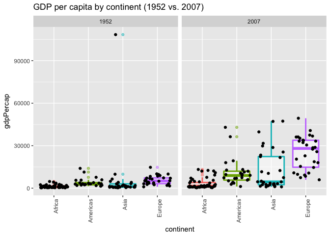

Homework \#2
================
Kaitlyn Harper
September 18, 2017

-   [Bring rectangular data in](#bring-rectangular-data-in)
-   ["Smell test" the data](#smell-test-the-data)
-   [Explore individual variables](#explore-individual-variables)
-   [Explore various plot types](#explore-various-plot-types)
    -   [Two continuous variables](#two-continuous-variables)
    -   [One qualitative variable](#one-qualitative-variable)
    -   [One qual + one quant variable](#one-qual-one-quant-variable)
-   [Use filter, select, and pipes!](#use-filter-select-and-pipes)
-   [More, more, more!](#more-more-more)
-   [Reflection](#reflection)

Bring rectangular data in
-------------------------

``` r
# Load tidyverse + all corresponding packages!
library(tidyverse)
```

    ## Loading tidyverse: ggplot2
    ## Loading tidyverse: tibble
    ## Loading tidyverse: tidyr
    ## Loading tidyverse: readr
    ## Loading tidyverse: purrr
    ## Loading tidyverse: dplyr

    ## Conflicts with tidy packages ----------------------------------------------

    ## filter(): dplyr, stats
    ## lag():    dplyr, stats

``` r
# Load gapminder dataset
library(gapminder)
data("gapminder")

#View data (just to make sure it's there)
head(gapminder)
```

    ## # A tibble: 6 x 6
    ##       country continent  year lifeExp      pop gdpPercap
    ##        <fctr>    <fctr> <int>   <dbl>    <int>     <dbl>
    ## 1 Afghanistan      Asia  1952  28.801  8425333  779.4453
    ## 2 Afghanistan      Asia  1957  30.332  9240934  820.8530
    ## 3 Afghanistan      Asia  1962  31.997 10267083  853.1007
    ## 4 Afghanistan      Asia  1967  34.020 11537966  836.1971
    ## 5 Afghanistan      Asia  1972  36.088 13079460  739.9811
    ## 6 Afghanistan      Asia  1977  38.438 14880372  786.1134

"Smell test" the data
---------------------

**Q1: Is it a data.frame, a matrix, a vector, a list?** **Q2: What’s its class?**

``` r
typeof(gapminder)
```

    ## [1] "list"

``` r
class(gapminder)
```

    ## [1] "tbl_df"     "tbl"        "data.frame"

The type of object is a list, but it has three official classes: *data frame tbl, tbl,* and *data frame*

**Q3: How many variables/columns?** **Q4: How many rows/observations?**

``` r
ncol(gapminder) # You can do this
```

    ## [1] 6

``` r
nrow(gapminder) # Plus this
```

    ## [1] 1704

``` r
dim(gapminder) # Or just do this!
```

    ## [1] 1704    6

There are 6 variables/columns and 1704 rows in this data set.

**Q5: Can you get these facts about “extent” or “size” in more than one way? Can you imagine different functions being useful in different contexts?**

``` r
glimpse(gapminder)
```

    ## Observations: 1,704
    ## Variables: 6
    ## $ country   <fctr> Afghanistan, Afghanistan, Afghanistan, Afghanistan,...
    ## $ continent <fctr> Asia, Asia, Asia, Asia, Asia, Asia, Asia, Asia, Asi...
    ## $ year      <int> 1952, 1957, 1962, 1967, 1972, 1977, 1982, 1987, 1992...
    ## $ lifeExp   <dbl> 28.801, 30.332, 31.997, 34.020, 36.088, 38.438, 39.8...
    ## $ pop       <int> 8425333, 9240934, 10267083, 11537966, 13079460, 1488...
    ## $ gdpPercap <dbl> 779.4453, 820.8530, 853.1007, 836.1971, 739.9811, 78...

``` r
str(gapminder)
```

    ## Classes 'tbl_df', 'tbl' and 'data.frame':    1704 obs. of  6 variables:
    ##  $ country  : Factor w/ 142 levels "Afghanistan",..: 1 1 1 1 1 1 1 1 1 1 ...
    ##  $ continent: Factor w/ 5 levels "Africa","Americas",..: 3 3 3 3 3 3 3 3 3 3 ...
    ##  $ year     : int  1952 1957 1962 1967 1972 1977 1982 1987 1992 1997 ...
    ##  $ lifeExp  : num  28.8 30.3 32 34 36.1 ...
    ##  $ pop      : int  8425333 9240934 10267083 11537966 13079460 14880372 12881816 13867957 16317921 22227415 ...
    ##  $ gdpPercap: num  779 821 853 836 740 ...

One way you could get these dimensions (and a bunch of other info about the data set) is by using the glimpse or str functions. These function provide the class of each variable, the number of different values for factor variables, and the first few rows for each variable. This could be helpful when you want to find out more info with fewer clicks, and it can also help us answer the next question! :)

**Q6: What flavor is each variable?**
The country and continent variables are **factors**; the year and pop variables are **integers**; the lifeExp and gdpPercap variables are **numeric**.

Explore individual variables
----------------------------

**Pick at least one categorical variable and at least one quantitative variable to explore.**
I will explore the country variable and the life expectancy variable.

**Characterize what’s possible, i.e. all possible values or max vs. min … whatever’s appropriate.**

``` r
# Qualitative variable: country
head(unique(gapminder$country)) # shows the unique values within the country variable (only showing the first six)
```

    ## [1] Afghanistan Albania     Algeria     Angola      Argentina   Australia  
    ## 142 Levels: Afghanistan Albania Algeria Angola Argentina ... Zimbabwe

``` r
length(unique(gapminder$country)) # number of unique values within the country variable
```

    ## [1] 142

``` r
head(table(gapminder$country)) # number of rows for each country (only showing first six)
```

    ## 
    ## Afghanistan     Albania     Algeria      Angola   Argentina   Australia 
    ##          12          12          12          12          12          12

``` r
numCountries = table(gapminder$continent)/(table(gapminder$country)[1]) # number of countries within each continent

# Quantitative variable: life expectancy 
summary(gapminder$lifeExp) # provides a simple statistical summary of the variable
```

    ##    Min. 1st Qu.  Median    Mean 3rd Qu.    Max. 
    ##   23.60   48.20   60.71   59.47   70.85   82.60

``` r
length(unique(round(gapminder$lifeExp, 1))) # provides the number of unique life expectancies for all rows (note: I rounded the numbers to provide a more general statistic)
```

    ## [1] 468

*Qualitative variable: country*
There are 142 unique countries in this data set. There are 195 countries in the world, so this data set is missing 53 countries. Each country contains 12 rows, or 12 different points in time. There are 5 continents represented in this data set. There are 52 countries represented from Africa, 25 countries represented from the Americas, 33 countries represented from Asia, 30 countries represented from Europe, and 2 countries represented from Oceania

*Quantitative variable: life expectancy*
First, we'll look at the life expectancy variable as a whole. The minimum life expectancy from all countries, all years was 23.6 and the maximum life expectancy was 82.6. The mean life expectancy was 59.47. However, this isn't all that helpful to us, because there are multiple countries and multiple time points measured. A bit later, we'll break up some of the countries and time points and get a better look!

**What’s typical? What’s the spread? What’s the distribution? Etc., tailored to the variable at hand.**

``` r
# Plot the life expectancy of each country
ggplot(gapminder, aes(country, lifeExp)) +
  geom_point() +
  theme(axis.text.x = element_text(angle = 90, hjust = 1)) +
  ylab("life expectancy (years)") + 
  ggtitle("Life expectancy of each country from 1952-2007")
```


Looks like the distribution of life expectancies varies a LOT between countries and also within the same country! Check out the plots below to get a better feel for the data!

Explore various plot types
--------------------------

Here are a few different plots using all the data (no filtering/grouping yet)

### Two continuous variables

``` r
a = ggplot(gapminder, aes(x= year, y = lifeExp))

# Plot life expectancy with unadjusted abline
a + geom_point() + 
  labs(title = "A look at life expectancy over the years 1952-2007, unadjusted", y = "life expectancy (years)") + stat_smooth(method="lm", se=FALSE, color = "lightblue", size = 2)
```


``` r
# Use linear regression to adjust for gdp per capita
reg = lm(gapminder$lifeExp ~ gapminder$year + gapminder$gdpPercap)
summary(reg)
```

    ## 
    ## Call:
    ## lm(formula = gapminder$lifeExp ~ gapminder$year + gapminder$gdpPercap)
    ## 
    ## Residuals:
    ##     Min      1Q  Median      3Q     Max 
    ## -67.262  -6.954   1.219   7.759  19.553 
    ## 
    ## Coefficients:
    ##                       Estimate Std. Error t value Pr(>|t|)    
    ## (Intercept)         -4.184e+02  2.762e+01  -15.15   <2e-16 ***
    ## gapminder$year       2.390e-01  1.397e-02   17.11   <2e-16 ***
    ## gapminder$gdpPercap  6.697e-04  2.447e-05   27.37   <2e-16 ***
    ## ---
    ## Signif. codes:  0 '***' 0.001 '**' 0.01 '*' 0.05 '.' 0.1 ' ' 1
    ## 
    ## Residual standard error: 9.694 on 1701 degrees of freedom
    ## Multiple R-squared:  0.4375, Adjusted R-squared:  0.4368 
    ## F-statistic: 661.4 on 2 and 1701 DF,  p-value: < 2.2e-16

``` r
coeffs = coefficients(reg)

# Plot life expectancy with abline, adjusted for GDP per capita
a + geom_point() + 
  labs(title = "A look at life expectancy over the years 1952-2007, adjusted for GDP per capita", y = "life expectancy (years)") + geom_abline(intercept = coeffs[1], slope = coeffs[2], color = "plum", size = 2)
```


### One qualitative variable

``` r
# Histogram of the distribution of life expectancies
ggplot(gapminder, aes(lifeExp)) +
  geom_histogram(binwidth = 2) +
  labs(y = "Count", x = "Life expectancy (years)", title= "Distribution of life expectancies")
```


``` r
# Barplot of the number of country observations within each continent
ggplot(gapminder, aes(continent)) +
  geom_bar() +
  ggtitle("Number of observations per continent")
```


### One qual + one quant variable

``` r
# Filter out the data for 2007
gapminder2007 = gapminder %>% 
                  filter(year == 2007)

# Plot gdp per capita for 2007, all countries grouped by continent
ggplot(gapminder2007, aes(continent, gdpPercap)) + 
  stat_boxplot() +
  ggtitle("GDP per capita for each continent in 2007")
```


``` r
rm(gapminder2007) #clean up environment
```

Cool! We can see the plot of data from 2007 above, so let's work off of that and see if we can compare each year.

``` r
length(unique(gapminder$year)) # there are 12 different years measured in these data
```

    ## [1] 12

``` r
ggplot(gapminder, aes(x=continent, y=gdpPercap)) +
  stat_boxplot() +
  facet_wrap(~ year) +
  theme(axis.text.x = element_text(angle = 90, hjust = 1))
```


Looks like the gdp per capita increases over the years and also becomes much more variable, especially in Asia and Europe. Interesting!

Use filter, select, and pipes!
------------------------------

``` r
# Plot the GDP of all countries (minus Oceania) in 1952 and 2007 
gapminder %>% 
  filter(continent != "Oceania", year == 1952 | year == 2007) %>% 
  ggplot(aes(x=continent, y=gdpPercap)) +
    stat_boxplot(alpha=1/2, size = 1, aes(color=continent), show.legend = FALSE) +
    facet_wrap(~ year) +
    theme(axis.text.x = element_text(angle = 90, hjust = 1)) + 
    ggtitle("GDP per capita by continent (1952 vs. 2007)")
```


``` r
# Add each individual country with "jitter"
gapminder %>% 
  filter(continent != "Oceania", year == 1952 | year == 2007) %>% 
  ggplot(aes(x=continent, y=gdpPercap)) +
    stat_boxplot(alpha=1/2, size = 1, aes(color=continent), show.legend = FALSE) +
    geom_jitter() +
    facet_wrap(~ year) +
    theme(axis.text.x = element_text(angle = 90, hjust = 1)) + 
    ggtitle("GDP per capita by continent (1952 vs. 2007)")
```



``` r
asia = gapminder %>% 
  filter(continent == "Asia", year == 2007) %>%                 # filter only Asia in 2007
  select(country, lifeExp, gdpPercap, pop) %>%                  # remove year and continent
  arrange(gdpPercap) %>%                                        # arrange from smallest to largest GDP
  mutate(gdpGroup = factor(cut(gdpPercap, quantile(gdpPercap), include.lowest= TRUE), labels = c("low", "low-middle", "middle-high", "high"))) 
                                                                # split gdp into four quantiles

# plot life expectancy by gdp group
ggplot(asia, aes(gdpPercap, lifeExp)) +
  geom_point(alpha=3/4, size=3, aes(color=country)) +
  facet_wrap(~ gdpGroup) +
  ggtitle("Life expectancy of Asian countries in 2007, grouped by GDP per capita")
```


``` r
rm(asia)
```

Let's explore some common factors in countries that lie below the life expectancy mean. We'll look at only data from 2007.

``` r
gap_mean = gapminder %>%
  mutate(LEgroup = ifelse(test = (gdpPercap < mean(gdpPercap)), yes = "low", no = "high")) %>% 
  filter(year == 2007) %>% 
  select(-year)

gap_mean %>% 
  ggplot(aes(gdpPercap)) +
  geom_density() + 
  facet_wrap(~ LEgroup)
```


``` r
gap_mean %>% 
  ggplot(aes(pop)) +
  geom_density() +
  facet_wrap(~ LEgroup)
```


``` r
gap_mean_arranged = gap_mean %>% arrange(LEgroup, pop)

gap_mean %>%
  filter(country != "China" & country != "India") %>% 
  ggplot(aes(pop)) +
  geom_density() +
  facet_wrap(~ LEgroup)
```


``` r
gap_mean %>% 
  ggplot(aes(continent)) +
  geom_bar() +
  facet_wrap(~ LEgroup)
```


More, more, more!
-----------------

Reflection
----------
