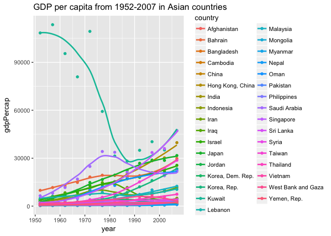
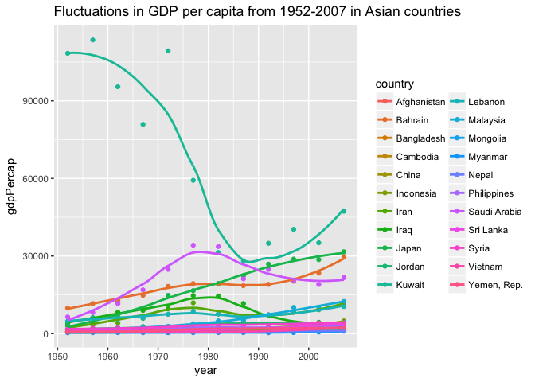
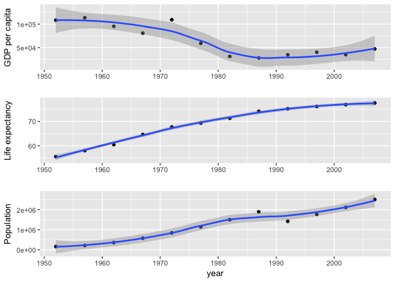

Homework \#3
================
Kaitlyn Harper
September 28, 2017

-   [Load data and packages](#load-data-and-packages)
-   [Look at the spread of GDP per capita within the continents.](#look-at-the-spread-of-gdp-per-capita-within-the-continents.)
-   [How is life expectancy changing over time on different continents?](#how-is-life-expectancy-changing-over-time-on-different-continents)
-   [Report the abundance of countries with low life expectancy over time by continent](#report-the-abundance-of-countries-with-low-life-expectancy-over-time-by-continent)
-   [Extra exploration](#extra-exploration)
-   [Reflection](#reflection)

Load data and packages
----------------------

``` r
# Load packages
library(tidyverse)
library(knitr)
library(kableExtra)
library(grid)

# Load gapminder dataset
library(gapminder)
data("gapminder")

#View data (just to make sure it's there)
head(gapminder)
```

    ## # A tibble: 6 x 6
    ##       country continent  year lifeExp      pop gdpPercap
    ##        <fctr>    <fctr> <int>   <dbl>    <int>     <dbl>
    ## 1 Afghanistan      Asia  1952  28.801  8425333  779.4453
    ## 2 Afghanistan      Asia  1957  30.332  9240934  820.8530
    ## 3 Afghanistan      Asia  1962  31.997 10267083  853.1007
    ## 4 Afghanistan      Asia  1967  34.020 11537966  836.1971
    ## 5 Afghanistan      Asia  1972  36.088 13079460  739.9811
    ## 6 Afghanistan      Asia  1977  38.438 14880372  786.1134

<a href="#top">Back to top</a>

Look at the spread of GDP per capita within the continents.
-----------------------------------------------------------

``` r
min_max = gapminder %>% 
  group_by(continent) %>% 
  summarise(maxGDP = max(gdpPercap), 
            minGDP = min(gdpPercap),
            meanGDP = mean(gdpPercap),
            sdGDP = sd(gdpPercap))

min_max %>% 
  kable(col.names = c("Continent", "Max GDP", "Min GDP", "Mean GDP", "SD GDP"), format = "html",
        caption = "Table 1. Spread of GDP per capita within each continent") %>% 
  kable_styling(bootstrap_options = c("striped", "hover"), full_width = F)
```

<table class="table table-striped table-hover" style="width: auto !important; margin-left: auto; margin-right: auto;">
<caption>
Table 1. Spread of GDP per capita within each continent
</caption>
<thead>
<tr>
<th style="text-align:left;">
Continent
</th>
<th style="text-align:right;">
Max GDP
</th>
<th style="text-align:right;">
Min GDP
</th>
<th style="text-align:right;">
Mean GDP
</th>
<th style="text-align:right;">
SD GDP
</th>
</tr>
</thead>
<tbody>
<tr>
<td style="text-align:left;">
Africa
</td>
<td style="text-align:right;">
21951.21
</td>
<td style="text-align:right;">
241.1659
</td>
<td style="text-align:right;">
2193.755
</td>
<td style="text-align:right;">
2827.930
</td>
</tr>
<tr>
<td style="text-align:left;">
Americas
</td>
<td style="text-align:right;">
42951.65
</td>
<td style="text-align:right;">
1201.6372
</td>
<td style="text-align:right;">
7136.110
</td>
<td style="text-align:right;">
6396.764
</td>
</tr>
<tr>
<td style="text-align:left;">
Asia
</td>
<td style="text-align:right;">
113523.13
</td>
<td style="text-align:right;">
331.0000
</td>
<td style="text-align:right;">
7902.150
</td>
<td style="text-align:right;">
14045.373
</td>
</tr>
<tr>
<td style="text-align:left;">
Europe
</td>
<td style="text-align:right;">
49357.19
</td>
<td style="text-align:right;">
973.5332
</td>
<td style="text-align:right;">
14469.476
</td>
<td style="text-align:right;">
9355.213
</td>
</tr>
<tr>
<td style="text-align:left;">
Oceania
</td>
<td style="text-align:right;">
34435.37
</td>
<td style="text-align:right;">
10039.5956
</td>
<td style="text-align:right;">
18621.609
</td>
<td style="text-align:right;">
6358.983
</td>
</tr>
</tbody>
</table>
``` r
gapminder %>%
  ggplot(aes(x=continent, y=gdpPercap)) +
  geom_boxplot(aes(fill = continent), show.legend = FALSE) +
  labs(x = "Country", y = "GDP per capita", title = "Spread of GDP per capita within each continent") +
  theme_dark(base_size = 13, base_family = "Courier")
```


``` r
rm(min_max)
```

<a href="#top">Back to top</a>

How is life expectancy changing over time on different continents?
------------------------------------------------------------------

``` r
gapMeanLE = gapminder %>%
  group_by(continent, year) %>% 
  summarise(meanLE = mean(lifeExp))

gapMeanLE = gapMeanLE %>%
  group_by(continent) %>% 
  summarise(deltaLE = round(meanLE[year==2007] - meanLE[year==1952], 2))

gapMeanLE %>% 
  kable(col.names = c("Continent", "Years"), align = "c", format = "html", 
        caption = "Table 2. Increases in life expectancy (in years) from 1952-2007") %>% 
  kable_styling(bootstrap_options = c("striped", "hover"), full_width = T)
```

<table class="table table-striped table-hover" style="margin-left: auto; margin-right: auto;">
<caption>
Table 2. Increases in life expectancy (in years) from 1952-2007
</caption>
<thead>
<tr>
<th style="text-align:center;">
Continent
</th>
<th style="text-align:center;">
Years
</th>
</tr>
</thead>
<tbody>
<tr>
<td style="text-align:center;">
Africa
</td>
<td style="text-align:center;">
15.67
</td>
</tr>
<tr>
<td style="text-align:center;">
Americas
</td>
<td style="text-align:center;">
20.33
</td>
</tr>
<tr>
<td style="text-align:center;">
Asia
</td>
<td style="text-align:center;">
24.41
</td>
</tr>
<tr>
<td style="text-align:center;">
Europe
</td>
<td style="text-align:center;">
13.24
</td>
</tr>
<tr>
<td style="text-align:center;">
Oceania
</td>
<td style="text-align:center;">
11.46
</td>
</tr>
</tbody>
</table>
``` r
gapminder %>%
  group_by(continent, year) %>% 
  summarise(meanLE = mean(lifeExp)) %>% 
  ggplot(aes(x=year, y=meanLE)) +
  geom_smooth(method="loess", aes(color=continent), se=FALSE) +
  scale_color_discrete("Continents") +
  labs(x="Year", y= "Mean Life Expectancy (Years)", title="Life expectancy changes in each continent, 1952-2007") +
  theme_light(base_family = "Palatino") +
  theme(panel.grid.major = element_blank(), panel.grid.minor = element_blank(), panel.border = element_blank())
```


``` r
rm(gapMeanLE) # cleanup
```

As we can see from the plot, all of the countries increased their life expectancies from 1952 to 2007. The table shows us that Asia had the largest change in life expectancy over this time period, with an increase of 24 years. Oceania had the smallest change in life expectancy (~11 years increase), but they already had the highest life expectancy to begin with and remained the life expectancy leader throughout the entire time period.

<a href="#top">Back to top</a>

Report the abundance of countries with low life expectancy over time by continent
---------------------------------------------------------------------------------

**Details: Compute some measure of worldwide life expectancy – you decide – a mean or median or some other quantile or perhaps your current age. Then determine how many countries on each continent have a life expectancy less than this benchmark, for each year.**

``` r
# Find the global mean and median life expectancies
summary(gapminder$lifeExp)[3:4] 
```

    ##   Median     Mean 
    ## 60.71250 59.47444

``` r
# median= ~59, mean= ~60
# Since they're about the same, I'll just use the mean

# Make table for countries with low LE
gapLowLE <- gapminder %>% 
    mutate(LEcat=c("low", "high")[(lifeExp>summary(gapminder$lifeExp)[[4]]) + 1]) %>% 
    select(1:3, 7) %>% 
    group_by(continent, year) %>% 
    summarise(numberLow = sum(LEcat=="low"), percentLow = 100*round(sum(LEcat=="low")/n(), 2))

# Plot percentage of countries with life exp lower than 60 years
gapLowLE %>% 
  ggplot(aes(x=year, y=percentLow)) +
  geom_bar(stat="identity") +
  facet_wrap(~ continent) +
  labs(x="Year", y="Percent of total countries", title="Percentage of countries with life expectancies lower than 60 years, by continent") +
  theme(strip.background = element_rect(fill="cornflower blue"),
        axis.title = element_text(size=14, face="italic"),
        strip.text = element_text(size=14, face="bold"))
```


``` r
# Make data table of countries and percentages

  # Create new data frame
  tab1 = data.frame(
  Year = as.vector(unique(gapminder$year)),
  Africa = as.vector(gapLowLE$percentLow[which(gapLowLE$continent=="Africa")]),
  Americas = as.vector(gapLowLE$percentLow[which(gapLowLE$continent=="Americas")]),
  Europe = as.vector(gapLowLE$percentLow[which(gapLowLE$continent=="Europe")]),
  Asia = as.vector(gapLowLE$percentLow[which(gapLowLE$continent=="Asia")]),
  Oceania = as.vector(gapLowLE$percentLow[which(gapLowLE$continent=="Oceania")])
  )

  # Format using kable
  knitr::kable(tab1, format = "html", caption = "Table 3. Percentage of countries per continent with life expectancy lower than 60 years")
```

<table>
<caption>
Table 3. Percentage of countries per continent with life expectancy lower than 60 years
</caption>
<thead>
<tr>
<th style="text-align:right;">
Year
</th>
<th style="text-align:right;">
Africa
</th>
<th style="text-align:right;">
Americas
</th>
<th style="text-align:right;">
Europe
</th>
<th style="text-align:right;">
Asia
</th>
<th style="text-align:right;">
Oceania
</th>
</tr>
</thead>
<tbody>
<tr>
<td style="text-align:right;">
1952
</td>
<td style="text-align:right;">
100
</td>
<td style="text-align:right;">
76
</td>
<td style="text-align:right;">
17
</td>
<td style="text-align:right;">
88
</td>
<td style="text-align:right;">
0
</td>
</tr>
<tr>
<td style="text-align:right;">
1957
</td>
<td style="text-align:right;">
100
</td>
<td style="text-align:right;">
60
</td>
<td style="text-align:right;">
10
</td>
<td style="text-align:right;">
79
</td>
<td style="text-align:right;">
0
</td>
</tr>
<tr>
<td style="text-align:right;">
1962
</td>
<td style="text-align:right;">
98
</td>
<td style="text-align:right;">
52
</td>
<td style="text-align:right;">
3
</td>
<td style="text-align:right;">
76
</td>
<td style="text-align:right;">
0
</td>
</tr>
<tr>
<td style="text-align:right;">
1967
</td>
<td style="text-align:right;">
96
</td>
<td style="text-align:right;">
40
</td>
<td style="text-align:right;">
3
</td>
<td style="text-align:right;">
70
</td>
<td style="text-align:right;">
0
</td>
</tr>
<tr>
<td style="text-align:right;">
1972
</td>
<td style="text-align:right;">
96
</td>
<td style="text-align:right;">
32
</td>
<td style="text-align:right;">
3
</td>
<td style="text-align:right;">
58
</td>
<td style="text-align:right;">
0
</td>
</tr>
<tr>
<td style="text-align:right;">
1977
</td>
<td style="text-align:right;">
94
</td>
<td style="text-align:right;">
28
</td>
<td style="text-align:right;">
0
</td>
<td style="text-align:right;">
42
</td>
<td style="text-align:right;">
0
</td>
</tr>
<tr>
<td style="text-align:right;">
1982
</td>
<td style="text-align:right;">
83
</td>
<td style="text-align:right;">
20
</td>
<td style="text-align:right;">
0
</td>
<td style="text-align:right;">
33
</td>
<td style="text-align:right;">
0
</td>
</tr>
<tr>
<td style="text-align:right;">
1987
</td>
<td style="text-align:right;">
75
</td>
<td style="text-align:right;">
8
</td>
<td style="text-align:right;">
0
</td>
<td style="text-align:right;">
24
</td>
<td style="text-align:right;">
0
</td>
</tr>
<tr>
<td style="text-align:right;">
1992
</td>
<td style="text-align:right;">
73
</td>
<td style="text-align:right;">
4
</td>
<td style="text-align:right;">
0
</td>
<td style="text-align:right;">
21
</td>
<td style="text-align:right;">
0
</td>
</tr>
<tr>
<td style="text-align:right;">
1997
</td>
<td style="text-align:right;">
75
</td>
<td style="text-align:right;">
4
</td>
<td style="text-align:right;">
0
</td>
<td style="text-align:right;">
18
</td>
<td style="text-align:right;">
0
</td>
</tr>
<tr>
<td style="text-align:right;">
2002
</td>
<td style="text-align:right;">
79
</td>
<td style="text-align:right;">
4
</td>
<td style="text-align:right;">
0
</td>
<td style="text-align:right;">
9
</td>
<td style="text-align:right;">
0
</td>
</tr>
<tr>
<td style="text-align:right;">
2007
</td>
<td style="text-align:right;">
77
</td>
<td style="text-align:right;">
0
</td>
<td style="text-align:right;">
0
</td>
<td style="text-align:right;">
3
</td>
<td style="text-align:right;">
0
</td>
</tr>
</tbody>
</table>
<a href="#top">Back to top</a>

Extra exploration
-----------------

**Details: Find countries with interesting stories. Open-ended and, therefore, hard. Promising but unsuccessful attempts are encouraged. This will generate interesting questions to follow up on in class.**

I want to look for countries that had a decrease and subsequent increase in gdp per capita, then look for trends within those countries. I will isolate countries in Asia just to make it easier on myself.

``` r
# Create a df with only countries from Asia
  Asia = gapminder %>%
    filter(continent=="Asia") 
   
# Plot the initial data in Asia
  Asia %>% 
    ggplot(aes(x=year, y=gdpPercap)) +
    geom_point(aes(color=country)) +
    geom_smooth(method="loess", aes(color=country), se=FALSE) +
    ggtitle("GDP per capita from 1952-2007 in Asian countries")
```



``` r
# Find only countries that have a decrease and then increase in GDP per capita
  gdpFlux = Asia %>% 
    group_by(country) %>% 
    mutate(deltaGDP= ifelse((lag(gdpPercap)>gdpPercap), "decrease", "increase")) %>%  #label countries as decrease or increase depending on their previous year's gdp per capita
    filter(deltaGDP == "decrease" & lead(deltaGDP) == "increase") %>% #isolate only those years where there was a decrease and increase after
    select(-deltaGDP) #clean up df a little (remove unnecessary column)

# Isolate the countries found in the process above (i.e. those with fluctuations in gdp per capita)
  flux = data.frame(unique(gdpFlux$country))

# Find percentage of countries in Asia that fluctuate gdp compared to those that don't fluctuate
  a = nrow(flux) # there are 22 countries in asia that fluctuate gdp per capita
  b = nrow(data.frame(unique(gapminder$country[which(gapminder$continent=="Asia")]))) # there are 33 countries total in Asia
  round((a/b)*100) #67% of countries in asia had fluctuating gdp's between 1952-2007
```

    ## [1] 67

``` r
# Plot flux countries   
  Asia %>% 
    filter(country %in% flux[,1]) %>%  #filter only countries in flux
    ggplot(aes(x=year, y=gdpPercap)) +
    geom_point(aes(color=country)) +
    geom_smooth(method="loess", aes(color=country), se=FALSE) +
    ggtitle("Fluctuations in GDP per capita from 1952-2007 in Asian countries")
```



``` r
rm(a,b, gdpFlux, Asia, flux) #cleanup
```

It looks like Kuwait is a pretty big outlier among the Asian countries! They had a huge decrease in gdp per capita until ~1987, then it started to increase a bit more. Let's take a closer look at this!

``` r
kuwait = gapminder %>% filter(country == "Kuwait")

gdpPlot = kuwait %>% 
  ggplot(aes(x=year, y=gdpPercap))+
  geom_point()+
  geom_smooth(method="loess")

LEplot = kuwait %>% 
  ggplot(aes(x=year, y=lifeExp))+
  geom_point()+
  geom_smooth(method="loess")

grid.newpage()
grid.draw(rbind(ggplotGrob(gdpPlot), ggplotGrob(LEplot), size = "last"))
```



<a href="#top">Back to top</a>

Reflection
----------

I found this assignment to be way more difficult than the previous two assignments, probably because it was more open-ended and less just plug and chug. There were a couple parts of my code that I think are pretty messy and I could clean up:

1.  

``` r
gapMeanLE = gapminder %>%
  group_by(continent, year) %>% 
  summarise(meanLE = mean(lifeExp))

gapMeanLE = gapMeanLE %>%
  group_by(continent) %>% 
  summarise(deltaLE = round(meanLE[year==2007] - meanLE[year==1952], 2))
```

In this chunk, I had to basically do two rounds of dplyr functions to get the output I wanted. I couldn't figure out how to summarise once and then summarise again, using the data I created from the first summarise function. I'm not sure if it's possible, but I feel like this was repetitive and could be way cleaner.

1.  

``` r
  tab1 = data.frame(
  Year = as.vector(unique(gapminder$year)),
  Africa = as.vector(gapLowLE$percentLow[which(gapLowLE$continent=="Africa")]),
  Americas = as.vector(gapLowLE$percentLow[which(gapLowLE$continent=="Americas")]),
  Europe = as.vector(gapLowLE$percentLow[which(gapLowLE$continent=="Europe")]),
  Asia = as.vector(gapLowLE$percentLow[which(gapLowLE$continent=="Asia")]),
  Oceania = as.vector(gapLowLE$percentLow[which(gapLowLE$continent=="Oceania")])
  )
```

In this chunk, I wanted to rearrange data from the previous data table and put it in a new format. Again, this feels really repetitive and I'm sure there was a better way to do this, but I couldn't figure out how. Apply functions perhaps? Any insight would be helpful :)

Other than that, I enjoyed the assignment and had fun formatting my plots with features I hadn't really known about previously (like how to format the title, text, etc.) It was also fun to start to ask random questions about the data and explore it how we would normally, instead of just answering simple, cookie cutter questions. I used ?function quite a bit to find out more about various functions, as well as explored some questions on Stack Overflow, like [this one](https://stackoverflow.com/questions/29904974/conditionally-count-in-dplyr) that has to do with counting values conditionally using dplyr.
