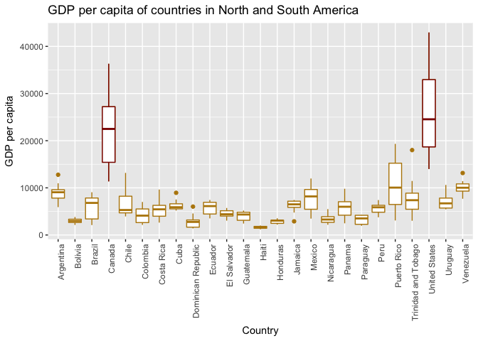

Homework \#3
================
Kaitlyn Harper
September 28, 2017

-   [Load data and packages](#load-data-and-packages)
-   [Look at the spread of GDP per capita within the continents.](#look-at-the-spread-of-gdp-per-capita-within-the-continents.)
-   [How is life expectancy changing over time on different continents?](#how-is-life-expectancy-changing-over-time-on-different-continents)
-   [Report the abundance of countries with low life expectancy over time by continent](#report-the-abundance-of-countries-with-low-life-expectancy-over-time-by-continent)
-   [Open exploration](#open-exploration)
-   [Reflection](#reflection)

Load data and packages
----------------------

``` r
# Load packages
library(tidyverse)
library(knitr)
library(kableExtra)
library(grid)
library(broom)

# Load gapminder dataset
library(gapminder)
data("gapminder")

#View data (just to make sure it's there)
head(gapminder)
```

    ## # A tibble: 6 x 6
    ##       country continent  year lifeExp      pop gdpPercap
    ##        <fctr>    <fctr> <int>   <dbl>    <int>     <dbl>
    ## 1 Afghanistan      Asia  1952  28.801  8425333  779.4453
    ## 2 Afghanistan      Asia  1957  30.332  9240934  820.8530
    ## 3 Afghanistan      Asia  1962  31.997 10267083  853.1007
    ## 4 Afghanistan      Asia  1967  34.020 11537966  836.1971
    ## 5 Afghanistan      Asia  1972  36.088 13079460  739.9811
    ## 6 Afghanistan      Asia  1977  38.438 14880372  786.1134

<a href="#top">Back to top</a>

Look at the spread of GDP per capita within the continents.
-----------------------------------------------------------

``` r
# Create new data set with max, min, mean, and sd of the GDP per capita
min_max = gapminder %>% 
  group_by(continent) %>% 
  summarise(maxGDP = max(gdpPercap), 
            minGDP = min(gdpPercap),
            meanGDP = mean(gdpPercap),
            sdGDP = sd(gdpPercap))

# Make kable data table with the new data frame above 
min_max %>% 
  kable(col.names = c("Continent", "Max GDP", "Min GDP", "Mean GDP", "SD GDP"), format = "html",
        caption = "Table 1. Spread of GDP per capita within each continent") %>% 
  kable_styling(bootstrap_options = c("striped", "hover"), full_width = F)
```

<table class="table table-striped table-hover" style="width: auto !important; margin-left: auto; margin-right: auto;">
<caption>
Table 1. Spread of GDP per capita within each continent
</caption>
<thead>
<tr>
<th style="text-align:left;">
Continent
</th>
<th style="text-align:right;">
Max GDP
</th>
<th style="text-align:right;">
Min GDP
</th>
<th style="text-align:right;">
Mean GDP
</th>
<th style="text-align:right;">
SD GDP
</th>
</tr>
</thead>
<tbody>
<tr>
<td style="text-align:left;">
Africa
</td>
<td style="text-align:right;">
21951.21
</td>
<td style="text-align:right;">
241.1659
</td>
<td style="text-align:right;">
2193.755
</td>
<td style="text-align:right;">
2827.930
</td>
</tr>
<tr>
<td style="text-align:left;">
Americas
</td>
<td style="text-align:right;">
42951.65
</td>
<td style="text-align:right;">
1201.6372
</td>
<td style="text-align:right;">
7136.110
</td>
<td style="text-align:right;">
6396.764
</td>
</tr>
<tr>
<td style="text-align:left;">
Asia
</td>
<td style="text-align:right;">
113523.13
</td>
<td style="text-align:right;">
331.0000
</td>
<td style="text-align:right;">
7902.150
</td>
<td style="text-align:right;">
14045.373
</td>
</tr>
<tr>
<td style="text-align:left;">
Europe
</td>
<td style="text-align:right;">
49357.19
</td>
<td style="text-align:right;">
973.5332
</td>
<td style="text-align:right;">
14469.476
</td>
<td style="text-align:right;">
9355.213
</td>
</tr>
<tr>
<td style="text-align:left;">
Oceania
</td>
<td style="text-align:right;">
34435.37
</td>
<td style="text-align:right;">
10039.5956
</td>
<td style="text-align:right;">
18621.609
</td>
<td style="text-align:right;">
6358.983
</td>
</tr>
</tbody>
</table>
``` r
# Plot the spread of GDP per capita 
gapminder %>%
  ggplot(aes(x=continent, y=gdpPercap)) +
  geom_boxplot(aes(fill = continent), show.legend = FALSE) +
  labs(x = "Country", y = "GDP per capita", title = "Spread of GDP per capita within each continent") +
  theme_dark(base_size = 13, base_family = "Courier")
```


``` r
rm(min_max) #cleanup
```

Okay, let's take a look at what we found. Looks like Africa and Asia both have pretty low mean GDPs, but Asia has a *much* wider spread than Africa. Asia has 2-4 big outliers that may skew the mean upward a bit. Oceania has the highest mean GDP and also a very small spread. I wonder if this is because there are only a few countries in Oceania and those countries are very similar to each other. The table shows us some information but really the plot is more visually appealing and easier to pick out trends.

<a href="#top">Back to top</a>

How is life expectancy changing over time on different continents?
------------------------------------------------------------------

``` r
# Create new df that summarises the mean life expectancy by continent and year
gapMeanLE = gapminder %>%
  group_by(continent, year) %>% 
  summarise(meanLE = mean(lifeExp))

# Summarise the new df by finding the differences in means between 1952-2007 for each continent
gapMeanLE = gapMeanLE %>%
  group_by(continent) %>% 
  summarise(deltaLE = round(meanLE[year==2007] - meanLE[year==1952], 2))

# Make a kable data table from the df above 
gapMeanLE %>% 
  kable(col.names = c("Continent", "Years"), align = "c", format = "html", 
        caption = "Table 2. Increases in life expectancy (in years) from 1952-2007") %>% 
  kable_styling(bootstrap_options = c("striped", "hover"), full_width = T)
```

<table class="table table-striped table-hover" style="margin-left: auto; margin-right: auto;">
<caption>
Table 2. Increases in life expectancy (in years) from 1952-2007
</caption>
<thead>
<tr>
<th style="text-align:center;">
Continent
</th>
<th style="text-align:center;">
Years
</th>
</tr>
</thead>
<tbody>
<tr>
<td style="text-align:center;">
Africa
</td>
<td style="text-align:center;">
15.67
</td>
</tr>
<tr>
<td style="text-align:center;">
Americas
</td>
<td style="text-align:center;">
20.33
</td>
</tr>
<tr>
<td style="text-align:center;">
Asia
</td>
<td style="text-align:center;">
24.41
</td>
</tr>
<tr>
<td style="text-align:center;">
Europe
</td>
<td style="text-align:center;">
13.24
</td>
</tr>
<tr>
<td style="text-align:center;">
Oceania
</td>
<td style="text-align:center;">
11.46
</td>
</tr>
</tbody>
</table>
Cool, that's semi-informative. But let's see how it looks on an actual plot...

``` r
# Plot the changes in mean life expectancy from 1952-2007
gapminder %>%
  group_by(continent, year) %>% 
  summarise(meanLE = mean(lifeExp)) %>% 
  ggplot(aes(x=year, y=meanLE)) +
  geom_smooth(method="loess", aes(color=continent), se=FALSE) +
  scale_color_discrete("Continents") +
  labs(x="Year", y= "Mean Life Expectancy (Years)", title="Life expectancy changes in each continent, 1952-2007") +
  theme_light(base_family = "Palatino") +
  theme(panel.grid.major = element_blank(), panel.grid.minor = element_blank(), panel.border = element_blank())
```


``` r
rm(gapMeanLE) # cleanup
```

As we can see from the plot, all of the countries increased their life expectancies from 1952 to 2007. The table shows us that Asia had the largest change in life expectancy over this time period, with an increase of 24 years. Oceania had the smallest change in life expectancy (~11 years increase), but they already had the highest life expectancy to begin with and remained the life expectancy leader throughout the entire time period.

<a href="#top">Back to top</a>

Report the abundance of countries with low life expectancy over time by continent
---------------------------------------------------------------------------------

**Details: Compute some measure of worldwide life expectancy – you decide – a mean or median or some other quantile or perhaps your current age. Then determine how many countries on each continent have a life expectancy less than this benchmark, for each year.**

``` r
# Find the global mean and median life expectancies
summary(gapminder$lifeExp)[3:4] 
```

    ##   Median     Mean 
    ## 60.71250 59.47444

``` r
# median= ~59, mean= ~60
# Since they're about the same, I'll just use the mean

# Make table for countries with low LE
gapLowLE <- gapminder %>% 
    mutate(LEcat=c("low", "high")[(lifeExp>summary(gapminder$lifeExp)[[4]]) + 1]) %>% 
    select(1:3, 7) %>% 
    group_by(continent, year) %>% 
    summarise(numberLow = sum(LEcat=="low"), percentLow = 100*round(sum(LEcat=="low")/n(), 2))

# Plot percentage of countries with life exp lower than 60 years
gapLowLE %>% 
  ggplot(aes(x=year, y=percentLow)) +
  geom_bar(stat="identity") +
  facet_wrap(~ continent) +
  labs(x="Year", y="Percent of total countries", title="Percentage of countries with life expectancies lower than 60 years, by continent") +
  theme(strip.background = element_rect(fill="cornflower blue"),
        axis.title = element_text(size=14, face="italic"),
        strip.text = element_text(size=14, face="bold"))
```


``` r
# Make data table of countries and percentages

  # Create new data frame - this is really repetitive!! :(
  tab1 = data.frame(
  Year = as.vector(unique(gapminder$year)),
  Africa = as.vector(gapLowLE$percentLow[which(gapLowLE$continent=="Africa")]),
  Americas = as.vector(gapLowLE$percentLow[which(gapLowLE$continent=="Americas")]),
  Europe = as.vector(gapLowLE$percentLow[which(gapLowLE$continent=="Europe")]),
  Asia = as.vector(gapLowLE$percentLow[which(gapLowLE$continent=="Asia")]),
  Oceania = as.vector(gapLowLE$percentLow[which(gapLowLE$continent=="Oceania")])
  )

  # Format using kable
  knitr::kable(tab1, format = "html", caption = "Table 3. Percentage of countries per continent with life expectancy lower than 60 years")
```

<table>
<caption>
Table 3. Percentage of countries per continent with life expectancy lower than 60 years
</caption>
<thead>
<tr>
<th style="text-align:right;">
Year
</th>
<th style="text-align:right;">
Africa
</th>
<th style="text-align:right;">
Americas
</th>
<th style="text-align:right;">
Europe
</th>
<th style="text-align:right;">
Asia
</th>
<th style="text-align:right;">
Oceania
</th>
</tr>
</thead>
<tbody>
<tr>
<td style="text-align:right;">
1952
</td>
<td style="text-align:right;">
100
</td>
<td style="text-align:right;">
76
</td>
<td style="text-align:right;">
17
</td>
<td style="text-align:right;">
88
</td>
<td style="text-align:right;">
0
</td>
</tr>
<tr>
<td style="text-align:right;">
1957
</td>
<td style="text-align:right;">
100
</td>
<td style="text-align:right;">
60
</td>
<td style="text-align:right;">
10
</td>
<td style="text-align:right;">
79
</td>
<td style="text-align:right;">
0
</td>
</tr>
<tr>
<td style="text-align:right;">
1962
</td>
<td style="text-align:right;">
98
</td>
<td style="text-align:right;">
52
</td>
<td style="text-align:right;">
3
</td>
<td style="text-align:right;">
76
</td>
<td style="text-align:right;">
0
</td>
</tr>
<tr>
<td style="text-align:right;">
1967
</td>
<td style="text-align:right;">
96
</td>
<td style="text-align:right;">
40
</td>
<td style="text-align:right;">
3
</td>
<td style="text-align:right;">
70
</td>
<td style="text-align:right;">
0
</td>
</tr>
<tr>
<td style="text-align:right;">
1972
</td>
<td style="text-align:right;">
96
</td>
<td style="text-align:right;">
32
</td>
<td style="text-align:right;">
3
</td>
<td style="text-align:right;">
58
</td>
<td style="text-align:right;">
0
</td>
</tr>
<tr>
<td style="text-align:right;">
1977
</td>
<td style="text-align:right;">
94
</td>
<td style="text-align:right;">
28
</td>
<td style="text-align:right;">
0
</td>
<td style="text-align:right;">
42
</td>
<td style="text-align:right;">
0
</td>
</tr>
<tr>
<td style="text-align:right;">
1982
</td>
<td style="text-align:right;">
83
</td>
<td style="text-align:right;">
20
</td>
<td style="text-align:right;">
0
</td>
<td style="text-align:right;">
33
</td>
<td style="text-align:right;">
0
</td>
</tr>
<tr>
<td style="text-align:right;">
1987
</td>
<td style="text-align:right;">
75
</td>
<td style="text-align:right;">
8
</td>
<td style="text-align:right;">
0
</td>
<td style="text-align:right;">
24
</td>
<td style="text-align:right;">
0
</td>
</tr>
<tr>
<td style="text-align:right;">
1992
</td>
<td style="text-align:right;">
73
</td>
<td style="text-align:right;">
4
</td>
<td style="text-align:right;">
0
</td>
<td style="text-align:right;">
21
</td>
<td style="text-align:right;">
0
</td>
</tr>
<tr>
<td style="text-align:right;">
1997
</td>
<td style="text-align:right;">
75
</td>
<td style="text-align:right;">
4
</td>
<td style="text-align:right;">
0
</td>
<td style="text-align:right;">
18
</td>
<td style="text-align:right;">
0
</td>
</tr>
<tr>
<td style="text-align:right;">
2002
</td>
<td style="text-align:right;">
79
</td>
<td style="text-align:right;">
4
</td>
<td style="text-align:right;">
0
</td>
<td style="text-align:right;">
9
</td>
<td style="text-align:right;">
0
</td>
</tr>
<tr>
<td style="text-align:right;">
2007
</td>
<td style="text-align:right;">
77
</td>
<td style="text-align:right;">
0
</td>
<td style="text-align:right;">
0
</td>
<td style="text-align:right;">
3
</td>
<td style="text-align:right;">
0
</td>
</tr>
</tbody>
</table>
I decided to look at the percentage of countries with low life expectancies (LE) opposed to the absolute (total) number; this is because there is a wide range of the number of countries represented in each continent. It's pretty shocking to see the differences in LE by continent; for example, in 1952, 100% of African countries had a LE lower than 60 years old, while Oceania (like all other years) had ZERO countries with LE lower than 60 years!! That's pretty crazy. Again, I feel like the table was less informative/appealing compared to the plot, but it is eye-catching to see all those zeros in the Oceania and Europe columns.

Also, on a little bit of a different note, it seems silly that the United States and Canada should be lumped in with South American countries. The characteristics of these two countries are probably starkly different than lower income countries in South America. In fact, let's just take a look at that really quickly now...

<a href="#top">Back to top</a>

Open exploration
----------------

*Details: Find countries with interesting stories. Open-ended and, therefore, hard. Promising but unsuccessful attempts are encouraged. This will generate interesting questions to follow up on in class.*

**Part 1: Americas**
I want to see how the US and Canada compare to other countries in the "Americas" group.

``` r
# filter only american countries from gapminder and plot them, highlighting Canada and US
gapminder %>% 
  filter(continent=="Americas") %>% 
  group_by(country) %>% 
  
  ggplot(aes(x=country, y=gdpPercap)) + #start plot
  
  geom_boxplot(color="darkgoldenrod") + #colour all points goldenrod
  
  geom_boxplot(data=gapminder[which(gapminder$country=="Canada"),], aes(x=country, y=gdpPercap), color="darkred") + #add layer that highlights canada
  
  geom_boxplot(data=gapminder[which(gapminder$country=="United States"),], aes(x=country, y=gdpPercap), color="darkred") + #add layer that highlights US
  
  theme(axis.text.x = element_text(angle = 90, hjust = 1)) + #adjust direction of text on x-axis
  
  labs(x="Country", y="GDP per capita", title= "GDP per capita of countries in North and South America")
```



So it looks like Canada and the US stand out with regards to GDP. Let's see if there's actually a difference between them. We'll choose five random countries, plus the US and Canada, and do an ANOVA test to see if they have significantly different GDP per capitas. To take out a bit of the time factor, we'll even reduce the data to 1992-2007. This will account for any countries that have changed significantly in the prior 40 years.

``` r
# Make df of American countries, minus US and Canada
americas = data.frame(
  country = unique(gapminder$country[which(gapminder$continent=="Americas")])) %>% 
  filter(country != "United States" & country != "Canada")

# Choose five random countries from the americas df, then add US and Canada
country_sample = sample_n(americas, 5) %>% #sample five random names from the americas df
  
  bind_rows(data.frame(country = c("United States", "Canada"))) #bind two rows with US and Canada onto the five random samples
```

    ## Warning in bind_rows_(x, .id): Unequal factor levels: coercing to character

    ## Warning in bind_rows_(x, .id): binding character and factor vector,
    ## coercing into character vector

    ## Warning in bind_rows_(x, .id): binding character and factor vector,
    ## coercing into character vector

``` r
# filter the gapminder df for only countries in the random sample (plus US and Canada), from 1992-2007
  comparison_sample = 
    gapminder %>% 
    filter(country %in% country_sample$country, year > 1987)
  
# Do ANOVA test between the 7 countries 
  
a1 = aov(gdpPercap~country, data = comparison_sample)

(t1 = TukeyHSD(x=a1, "country"))
```

    ##   Tukey multiple comparisons of means
    ##     95% family-wise confidence level
    ## 
    ## Fit: aov(formula = gdpPercap ~ country, data = comparison_sample)
    ## 
    ## $country
    ##                                               diff         lwr        upr
    ## Canada-Brazil                           23210.1832  15757.7300  30662.636
    ## Chile-Brazil                             2389.8311  -5062.6221   9842.284
    ## Dominican Republic-Brazil               -3714.4448 -11166.8980   3738.008
    ## Panama-Brazil                            -301.9062  -7754.3593   7150.547
    ## Trinidad and Tobago-Brazil               3381.8490  -4070.6042  10834.302
    ## United States-Brazil                    29428.7101  21976.2569  36881.163
    ## Chile-Canada                           -20820.3521 -28272.8053 -13367.899
    ## Dominican Republic-Canada              -26924.6280 -34377.0811 -19472.175
    ## Panama-Canada                          -23512.0893 -30964.5425 -16059.636
    ## Trinidad and Tobago-Canada             -19828.3342 -27280.7874 -12375.881
    ## United States-Canada                     6218.5269  -1233.9263  13670.980
    ## Dominican Republic-Chile                -6104.2759 -13556.7290   1348.177
    ## Panama-Chile                            -2691.7372 -10144.1904   4760.716
    ## Trinidad and Tobago-Chile                 992.0179  -6460.4353   8444.471
    ## United States-Chile                     27038.8790  19586.4258  34491.332
    ## Panama-Dominican Republic                3412.5386  -4039.9146  10864.992
    ## Trinidad and Tobago-Dominican Republic   7096.2938   -356.1594  14548.747
    ## United States-Dominican Republic        33143.1549  25690.7017  40595.608
    ## Trinidad and Tobago-Panama               3683.7552  -3768.6980  11136.208
    ## United States-Panama                    29730.6163  22278.1631  37183.069
    ## United States-Trinidad and Tobago       26046.8611  18594.4079  33499.314
    ##                                            p adj
    ## Canada-Brazil                          0.0000000
    ## Chile-Brazil                           0.9377259
    ## Dominican Republic-Brazil              0.6716818
    ## Panama-Brazil                          0.9999994
    ## Trinidad and Tobago-Brazil             0.7556505
    ## United States-Brazil                   0.0000000
    ## Chile-Canada                           0.0000002
    ## Dominican Republic-Canada              0.0000000
    ## Panama-Canada                          0.0000000
    ## Trinidad and Tobago-Canada             0.0000004
    ## United States-Canada                   0.1437094
    ## Dominican Republic-Chile               0.1573122
    ## Panama-Chile                           0.8961180
    ## Trinidad and Tobago-Chile              0.9993729
    ## United States-Chile                    0.0000000
    ## Panama-Dominican Republic              0.7482162
    ## Trinidad and Tobago-Dominican Republic 0.0686987
    ## United States-Dominican Republic       0.0000000
    ## Trinidad and Tobago-Panama             0.6796875
    ## United States-Panama                   0.0000000
    ## United States-Trinidad and Tobago      0.0000000

You might be saying- wow, there's a lot going on here! True, true, but that's because we are comparing 7 different countries. So what conclusions can we draw from this? Well, assuming a significance value of p=0.05, we can see that there a number of countries that are not significantly different from each other (e.g. Honduras-Boliva, p=1.0), but there are also many countries that ARE significantly different from each other. Let's extract only the ones that contain Canada or the US and see if they are significantly different than the other countries:

``` r
# Extract only comparisons between US-other countries and Canada-other countries
t2 = as.data.frame(tidy(t1)) %>% 
  filter(grepl("United States|Canada", comparison))

knitr::kable(t2, format = "html", caption = "Table 4. Comparisons between US-other countries and Canada-other countries using ANOVA and Tukey's multiple comparison tests")
```

<table>
<caption>
Table 4. Comparisons between US-other countries and Canada-other countries using ANOVA and Tukey's multiple comparison tests
</caption>
<thead>
<tr>
<th style="text-align:left;">
term
</th>
<th style="text-align:left;">
comparison
</th>
<th style="text-align:right;">
estimate
</th>
<th style="text-align:right;">
conf.low
</th>
<th style="text-align:right;">
conf.high
</th>
<th style="text-align:right;">
adj.p.value
</th>
</tr>
</thead>
<tbody>
<tr>
<td style="text-align:left;">
country
</td>
<td style="text-align:left;">
Canada-Brazil
</td>
<td style="text-align:right;">
23210.183
</td>
<td style="text-align:right;">
15757.730
</td>
<td style="text-align:right;">
30662.64
</td>
<td style="text-align:right;">
0.0000000
</td>
</tr>
<tr>
<td style="text-align:left;">
country
</td>
<td style="text-align:left;">
United States-Brazil
</td>
<td style="text-align:right;">
29428.710
</td>
<td style="text-align:right;">
21976.257
</td>
<td style="text-align:right;">
36881.16
</td>
<td style="text-align:right;">
0.0000000
</td>
</tr>
<tr>
<td style="text-align:left;">
country
</td>
<td style="text-align:left;">
Chile-Canada
</td>
<td style="text-align:right;">
-20820.352
</td>
<td style="text-align:right;">
-28272.805
</td>
<td style="text-align:right;">
-13367.90
</td>
<td style="text-align:right;">
0.0000002
</td>
</tr>
<tr>
<td style="text-align:left;">
country
</td>
<td style="text-align:left;">
Dominican Republic-Canada
</td>
<td style="text-align:right;">
-26924.628
</td>
<td style="text-align:right;">
-34377.081
</td>
<td style="text-align:right;">
-19472.17
</td>
<td style="text-align:right;">
0.0000000
</td>
</tr>
<tr>
<td style="text-align:left;">
country
</td>
<td style="text-align:left;">
Panama-Canada
</td>
<td style="text-align:right;">
-23512.089
</td>
<td style="text-align:right;">
-30964.543
</td>
<td style="text-align:right;">
-16059.64
</td>
<td style="text-align:right;">
0.0000000
</td>
</tr>
<tr>
<td style="text-align:left;">
country
</td>
<td style="text-align:left;">
Trinidad and Tobago-Canada
</td>
<td style="text-align:right;">
-19828.334
</td>
<td style="text-align:right;">
-27280.787
</td>
<td style="text-align:right;">
-12375.88
</td>
<td style="text-align:right;">
0.0000004
</td>
</tr>
<tr>
<td style="text-align:left;">
country
</td>
<td style="text-align:left;">
United States-Canada
</td>
<td style="text-align:right;">
6218.527
</td>
<td style="text-align:right;">
-1233.926
</td>
<td style="text-align:right;">
13670.98
</td>
<td style="text-align:right;">
0.1437094
</td>
</tr>
<tr>
<td style="text-align:left;">
country
</td>
<td style="text-align:left;">
United States-Chile
</td>
<td style="text-align:right;">
27038.879
</td>
<td style="text-align:right;">
19586.426
</td>
<td style="text-align:right;">
34491.33
</td>
<td style="text-align:right;">
0.0000000
</td>
</tr>
<tr>
<td style="text-align:left;">
country
</td>
<td style="text-align:left;">
United States-Dominican Republic
</td>
<td style="text-align:right;">
33143.155
</td>
<td style="text-align:right;">
25690.702
</td>
<td style="text-align:right;">
40595.61
</td>
<td style="text-align:right;">
0.0000000
</td>
</tr>
<tr>
<td style="text-align:left;">
country
</td>
<td style="text-align:left;">
United States-Panama
</td>
<td style="text-align:right;">
29730.616
</td>
<td style="text-align:right;">
22278.163
</td>
<td style="text-align:right;">
37183.07
</td>
<td style="text-align:right;">
0.0000000
</td>
</tr>
<tr>
<td style="text-align:left;">
country
</td>
<td style="text-align:left;">
United States-Trinidad and Tobago
</td>
<td style="text-align:right;">
26046.861
</td>
<td style="text-align:right;">
18594.408
</td>
<td style="text-align:right;">
33499.31
</td>
<td style="text-align:right;">
0.0000000
</td>
</tr>
</tbody>
</table>
Soooo what we can see is that all of the comparisons between the US-other countries, and Canada-other countries, have a p-value &lt; 0.05. Without going into the whole confidence interval/p-value spiel, let's just say that they're all significantly different. Even the US-Canada p-value is &lt; 0.05 (with a CI that doesn't cross 0), but just barely. I'd say they're pretty dang similar. The other p-values are really small (like so small that they just show up on here as zero...) and the other CIs are not even close to crossing zero.

Conclusion: Even though we just looked at GDP and no other variables, we can conclude that the US and Canada are significant outliers in the "Americas" group, and they probably could've/should've been put into a separate category. But hey, at least now we know, right?

**Part 2: Asia**
I want to look for countries that had a decrease and subsequent increase in gdp per capita, then look for trends within those countries. I will isolate countries in Asia just to make it easier for myself.

``` r
# Create a df with only countries from Asia
  Asia = gapminder %>%
    filter(continent=="Asia") 
   
# Plot the initial data in Asia
  Asia %>% 
    ggplot(aes(x=year, y=gdpPercap)) +
    geom_point(aes(color=country)) +
    geom_smooth(method="loess", aes(color=country), se=FALSE) +
    ggtitle("GDP per capita from 1952-2007 in Asian countries")
```


``` r
# Find only countries that have a decrease and then increase in GDP per capita
  gdpFlux = Asia %>% 
    group_by(country) %>% 
    mutate(deltaGDP= ifelse((lag(gdpPercap)>gdpPercap), "decrease", "increase")) %>%  #label countries as decrease or increase depending on their previous year's gdp per capita
    filter(deltaGDP == "decrease" & lead(deltaGDP) == "increase") %>% #isolate only those years where there was a decrease and increase after
    select(-deltaGDP) #clean up df a little (remove unnecessary column)

# Isolate the countries found in the process above (i.e. those with fluctuations in gdp per capita)
  flux = data.frame(unique(gdpFlux$country))

# Find percentage of countries in Asia that fluctuate gdp compared to those that don't fluctuate
  a = nrow(flux) # there are 22 countries in asia that fluctuate gdp per capita
  b = nrow(data.frame(unique(gapminder$country[which(gapminder$continent=="Asia")]))) # there are 33 countries total in Asia
  round((a/b)*100) #67% of countries in asia had fluctuating gdp's between 1952-2007
```

    ## [1] 67

``` r
# Plot flux countries   
  Asia %>% 
    filter(country %in% flux[,1]) %>%  #filter only countries in flux
    ggplot(aes(x=year, y=gdpPercap)) +
    geom_point(aes(color=country)) +
    geom_smooth(method="loess", aes(color=country), se=FALSE) +
    ggtitle("Fluctuations in GDP per capita from 1952-2007 in Asian countries")
```


``` r
rm(a,b, gdpFlux, Asia, flux) #cleanup
```

It looks like Kuwait is a pretty big outlier among the Asian countries! They had a huge decrease in gdp per capita until ~1987, then it started to increase a bit more. Let's take a closer look at this!

``` r
kuwait = gapminder %>% filter(country == "Kuwait")

gdpPlot = kuwait %>% 
  ggplot(aes(x=year, y=gdpPercap))+
  geom_point()+
  geom_smooth(method="loess")+
  labs(y= "GDP per capita", x="")

LEplot = kuwait %>% 
  ggplot(aes(x=year, y=lifeExp))+
  geom_point()+
  geom_smooth(method="loess") +
  labs(y= "Life expectancy", x="")

popPlot = kuwait %>% 
  ggplot(aes(x=year, y=pop))+
  geom_point()+
  geom_smooth(method="loess")+
  labs(y= "Population")

grid.newpage()
grid.draw(rbind(ggplotGrob(gdpPlot), ggplotGrob(LEplot), ggplotGrob(popPlot), size = "last"))
```


How interesting - it looks like both life expectancy and population continue to increase (with a slight fluctuation in population), even while the GDP per capita decreases. I would assume that life expectancy and GDP per capita would be associated... I would do some analyses on it, but honestly I don't know how to do nonlinear longitudinal analyses haha

<a href="#top">Back to top</a>

Reflection
----------

I found this assignment to be more difficult than the previous two assignments, probably because it was more open-ended and less just plug and chug. But I also feel like I learned a TON and got to experiment with a lot of functions that we haven't used in class, especially in the open exploration part of the assignment.

That said, there were a couple parts of my code that I think are pretty messy and I could clean up:

``` r
gapMeanLE = gapminder %>%
  group_by(continent, year) %>% 
  summarise(meanLE = mean(lifeExp))

gapMeanLE = gapMeanLE %>%
  group_by(continent) %>% 
  summarise(deltaLE = round(meanLE[year==2007] - meanLE[year==1952], 2))
```

In this chunk, I had to basically do two rounds of dplyr functions to get the output I wanted. I couldn't figure out how to summarise once and then summarise again, using the data I created from the first summarise function. I'm not sure if it's possible, but I feel like this was repetitive and could be way cleaner.

``` r
  tab1 = data.frame(
  Year = as.vector(unique(gapminder$year)),
  Africa = as.vector(gapLowLE$percentLow[which(gapLowLE$continent=="Africa")]),
  Americas = as.vector(gapLowLE$percentLow[which(gapLowLE$continent=="Americas")]),
  Europe = as.vector(gapLowLE$percentLow[which(gapLowLE$continent=="Europe")]),
  Asia = as.vector(gapLowLE$percentLow[which(gapLowLE$continent=="Asia")]),
  Oceania = as.vector(gapLowLE$percentLow[which(gapLowLE$continent=="Oceania")])
  )
```

In this chunk, I wanted to rearrange data from the previous data table and put it in a new format. Again, this feels really repetitive and I'm sure there was a better way to do this, but I couldn't figure out how. Apply function(s) perhaps? Any insight would be helpful :)

Other than that, I enjoyed the assignment and had fun formatting my plots with features I hadn't really known about previously (e.g. formatting the title, text, etc.) It was also fun to start to ask random questions about the data and explore it how we would IRL, instead of just answering simple, cookie-cutter questions. I used `?function` quite a bit to find out more about various functions, as well as explored some questions on Stack Overflow, like [this one](https://stackoverflow.com/questions/29904974/conditionally-count-in-dplyr) that has to do with counting values conditionally using dplyr.

<a href="#top">Back to top</a>
