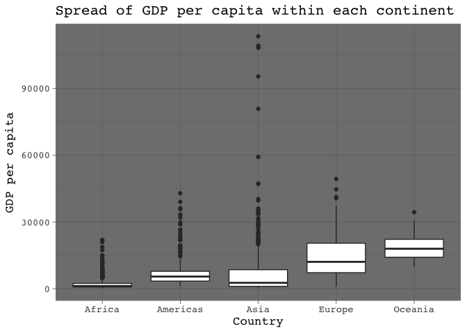

Homework \#3
================
Kaitlyn Harper
September 28, 2017

-   [Load data and packages](#load-data-and-packages)
-   [Get the maximum and minimum of GDP per capita for all continents.](#get-the-maximum-and-minimum-of-gdp-per-capita-for-all-continents.)
-   [Look at the spread of GDP per capita within the continents.](#look-at-the-spread-of-gdp-per-capita-within-the-continents.)
-   [Compute a trimmed mean of life expectancy for different years. Or a weighted mean, weighting by population. Just try something other than the plain vanilla mean.](#compute-a-trimmed-mean-of-life-expectancy-for-different-years.-or-a-weighted-mean-weighting-by-population.-just-try-something-other-than-the-plain-vanilla-mean.)
-   [How is life expectancy changing over time on different continents?](#how-is-life-expectancy-changing-over-time-on-different-continents)
-   [Report the absolute and/or relative abundance of countries with low life expectancy over time by continent: Compute some measure of worldwide life expectancy – you decide – a mean or median or some other quantile or perhaps your current age. Then determine how many countries on each continent have a life expectancy less than this benchmark, for each year.](#report-the-absolute-andor-relative-abundance-of-countries-with-low-life-expectancy-over-time-by-continent-compute-some-measure-of-worldwide-life-expectancy-you-decide-a-mean-or-median-or-some-other-quantile-or-perhaps-your-current-age.-then-determine-how-many-countries-on-each-continent-have-a-life-expectancy-less-than-this-benchmark-for-each-year.)
-   [Find countries with interesting stories. Open-ended and, therefore, hard. Promising but unsuccessful attempts are encouraged. This will generate interesting questions to follow up on in class.](#find-countries-with-interesting-stories.-open-ended-and-therefore-hard.-promising-but-unsuccessful-attempts-are-encouraged.-this-will-generate-interesting-questions-to-follow-up-on-in-class.)

Load data and packages
----------------------

``` r
# Load packages
library(tidyverse)
```

    ## Loading tidyverse: ggplot2
    ## Loading tidyverse: tibble
    ## Loading tidyverse: tidyr
    ## Loading tidyverse: readr
    ## Loading tidyverse: purrr
    ## Loading tidyverse: dplyr

    ## Conflicts with tidy packages ----------------------------------------------

    ## filter(): dplyr, stats
    ## lag():    dplyr, stats

``` r
library(knitr)

# Load gapminder dataset
library(gapminder)
data("gapminder")

#View data (just to make sure it's there)
head(gapminder)
```

    ## # A tibble: 6 x 6
    ##       country continent  year lifeExp      pop gdpPercap
    ##        <fctr>    <fctr> <int>   <dbl>    <int>     <dbl>
    ## 1 Afghanistan      Asia  1952  28.801  8425333  779.4453
    ## 2 Afghanistan      Asia  1957  30.332  9240934  820.8530
    ## 3 Afghanistan      Asia  1962  31.997 10267083  853.1007
    ## 4 Afghanistan      Asia  1967  34.020 11537966  836.1971
    ## 5 Afghanistan      Asia  1972  36.088 13079460  739.9811
    ## 6 Afghanistan      Asia  1977  38.438 14880372  786.1134

<a href="#top">Back to top</a>

Get the maximum and minimum of GDP per capita for all continents.
-----------------------------------------------------------------

``` r
min_max = gapminder %>% 
  group_by(continent) %>% 
  summarise(maxGDP = max(gdpPercap), minGDP = min(gdpPercap))

knitr::kable(min_max, col.names = c("Continent", "Max GDP", "Min GDP"))
```

| Continent |    Max GDP|     Min GDP|
|:----------|----------:|-----------:|
| Africa    |   21951.21|    241.1659|
| Americas  |   42951.65|   1201.6372|
| Asia      |  113523.13|    331.0000|
| Europe    |   49357.19|    973.5332|
| Oceania   |   34435.37|  10039.5956|

Look at the spread of GDP per capita within the continents.
-----------------------------------------------------------

``` r
gapminder %>%
  ggplot(aes(x=continent, y=gdpPercap)) +
  geom_boxplot() +
  labs(x = "Country", y = "GDP per capita", title = "Spread of GDP per capita within each continent") +
  theme_dark(base_size = 13, base_family = "Courier")
```



Compute a trimmed mean of life expectancy for different years. Or a weighted mean, weighting by population. Just try something other than the plain vanilla mean.
-----------------------------------------------------------------------------------------------------------------------------------------------------------------

How is life expectancy changing over time on different continents?
------------------------------------------------------------------

Report the absolute and/or relative abundance of countries with low life expectancy over time by continent: Compute some measure of worldwide life expectancy – you decide – a mean or median or some other quantile or perhaps your current age. Then determine how many countries on each continent have a life expectancy less than this benchmark, for each year.
---------------------------------------------------------------------------------------------------------------------------------------------------------------------------------------------------------------------------------------------------------------------------------------------------------------------------------------------------------------------

Find countries with interesting stories. Open-ended and, therefore, hard. Promising but unsuccessful attempts are encouraged. This will generate interesting questions to follow up on in class.
------------------------------------------------------------------------------------------------------------------------------------------------------------------------------------------------
