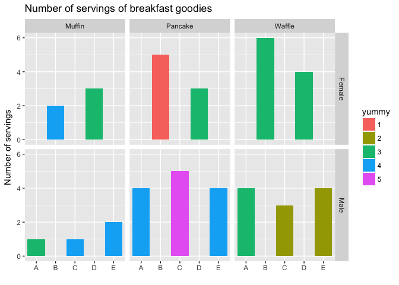

Homework 4
================
Kaitlyn Harper
October 5, 2017

-   [Part 1, Activity \#1 - Cheatsheet for dealing with messy data](#part-1-activity-1---cheatsheet-for-dealing-with-messy-data)
    -   [What's the deal with "messy data"?](#whats-the-deal-with-messy-data)
    -   [`Gather`](#gather)
    -   [Breakfast patterns](#breakfast-patterns)
    -   [`Spread`](#spread)
-   [Part 2, Activity \#2 - cheatsheet for join functions](#part-2-activity-2---cheatsheet-for-join-functions)
    -   [Mutating joins](#mutating-joins)
    -   [Filtering joins](#filtering-joins)
    -   [Reflection](#reflection)

``` r
suppressMessages(library(tidyverse))
suppressMessages(library(knitr))
```

Part 1, Activity \#1 - Cheatsheet for dealing with messy data
-------------------------------------------------------------

Hi there! Welcome to my messy data cheatsheet. I got most of my information from [this](http://vita.had.co.nz/papers/tidy-data.pdf) paper, written by the one and only Hadley Wickham. He goes into a lot more detail and uses large data sets as examples, so definitely check it out if you find yourself itching for more information!

Okay then, let's get going!

### What's the deal with "messy data"?

Imagine this: You get to your office early one morning, keen to start your productive work day. The sun is shining, the birds are singing, and you are READY to explore that new data set your supervisor shared with you yesterday. Or so you think. As you sip your coffee, you open up the new data set in R and you see... this:

| subject | food    |    1|    2|    3|    4|    5|
|:--------|:--------|----:|----:|----:|----:|----:|
| Am      | muffin  |   NA|   NA|    1|   NA|   NA|
| Am      | pancake |   NA|   NA|   NA|    4|   NA|
| Am      | waffle  |   NA|   NA|    4|   NA|   NA|
| Bf      | muffin  |   NA|   NA|   NA|    2|   NA|
| Bf      | pancake |    5|   NA|   NA|   NA|   NA|
| Bf      | waffle  |   NA|   NA|    6|   NA|   NA|
| Cm      | muffin  |   NA|   NA|   NA|    1|   NA|
| Cm      | pancake |   NA|   NA|   NA|   NA|    5|
| Cm      | waffle  |   NA|    3|   NA|   NA|   NA|
| Df      | muffin  |   NA|   NA|    3|   NA|   NA|
| Df      | pancake |   NA|   NA|    3|   NA|   NA|
| Df      | waffle  |   NA|   NA|    4|   NA|   NA|
| Em      | muffin  |   NA|   NA|   NA|    2|   NA|
| Em      | pancake |   NA|   NA|   NA|    4|   NA|
| Em      | waffle  |   NA|    4|   NA|   NA|   NA|

This, my friends, is what we call messy data. Like, what is even going on here?? Oh wait- what's this? Ohhhh, luckily, there's a note on your desk with more information about the data! Unnnnluckily, it's in the handwriting of the first year undergrad that also works in your lab...

*"HI! I collected these data because I wanted to be helpful! The study is on the yummy-ness of breakfast foods versus how much of that food they actually eat -- neat huh?? I designed it myself. I even got a sample size of five people!!"*

You stop for a moment. 🙄 \*Breathe\* After taking a significant swig of coffee, you keep reading.

*"The subject variable has the code (A-E) for each individual, as well as their sex (binary-f/m). The food obviously refers to the breakfast food. Each of the other columns ("1"-"5") represent how "yummy" the subjects thought the foods were (1=awful; 5=deeeelicious) and the values represent the number of servings they normally eat of that specific food during a meal. Anyway, thanks for analyzing it for me! Have fun!"*

Wow, yep, super fun. Thanks.

See, in a perfect world we would have beautiful data all the time, and analysing it would be a breeze. Unfortunately, we live in a world where Donald Trump became president of the United States (i.e. not perfect); thus, the data we're given isn't always clean and pristine.

There are **three things** that make data tidy, according to our good friend Hadley. Let's see if your data fit the criteria:
- Each variable forms a column. *Nope, nowhere in there do I see the "number of servings" variable*
- Each observation forms a row. *Okay, we're good with this one I think*
- Each type of observational unit forms a table. *Nope, we need to separate subject and sex*

Looks like we definitely have some tidying to do. Alright, enough yabbering, let's get going on those analyses!

<a href="#top">Back to top</a>

### `Gather`

But what to do about these messy data? Doo-doo-DOO! :trumpet: Have no fear - `gather` is here! `Gather` is a really helpful function in the `tidyr` package that literally "gathers" up your data and collapses it into what are known as "key-value pairs". The `key` part takes each of the header (column) names that you specify and makes them into variables. The `value` part takes each of the messy values that are all spread out in the original "key" columns and **stacks them** on top of each other. Let's see it in action:

``` r
(clean_breakfast = gather(breakfast_messy, yummy, number, -c(subject, food)))
```

    ##    subject    food yummy number
    ## 1       Am  muffin     1     NA
    ## 2       Am pancake     1     NA
    ## 3       Am  waffle     1     NA
    ## 4       Bf  muffin     1     NA
    ## 5       Bf pancake     1      5
    ## 6       Bf  waffle     1     NA
    ## 7       Cm  muffin     1     NA
    ## 8       Cm pancake     1     NA
    ## 9       Cm  waffle     1     NA
    ## 10      Df  muffin     1     NA
    ## 11      Df pancake     1     NA
    ## 12      Df  waffle     1     NA
    ## 13      Em  muffin     1     NA
    ## 14      Em pancake     1     NA
    ## 15      Em  waffle     1     NA
    ## 16      Am  muffin     2     NA
    ## 17      Am pancake     2     NA
    ## 18      Am  waffle     2     NA
    ## 19      Bf  muffin     2     NA
    ## 20      Bf pancake     2     NA
    ## 21      Bf  waffle     2     NA
    ## 22      Cm  muffin     2     NA
    ## 23      Cm pancake     2     NA
    ## 24      Cm  waffle     2      3
    ## 25      Df  muffin     2     NA
    ## 26      Df pancake     2     NA
    ## 27      Df  waffle     2     NA
    ## 28      Em  muffin     2     NA
    ## 29      Em pancake     2     NA
    ## 30      Em  waffle     2      4
    ## 31      Am  muffin     3      1
    ## 32      Am pancake     3     NA
    ## 33      Am  waffle     3      4
    ## 34      Bf  muffin     3     NA
    ## 35      Bf pancake     3     NA
    ## 36      Bf  waffle     3      6
    ## 37      Cm  muffin     3     NA
    ## 38      Cm pancake     3     NA
    ## 39      Cm  waffle     3     NA
    ## 40      Df  muffin     3      3
    ## 41      Df pancake     3      3
    ## 42      Df  waffle     3      4
    ## 43      Em  muffin     3     NA
    ## 44      Em pancake     3     NA
    ## 45      Em  waffle     3     NA
    ## 46      Am  muffin     4     NA
    ## 47      Am pancake     4      4
    ## 48      Am  waffle     4     NA
    ## 49      Bf  muffin     4      2
    ## 50      Bf pancake     4     NA
    ## 51      Bf  waffle     4     NA
    ## 52      Cm  muffin     4      1
    ## 53      Cm pancake     4     NA
    ## 54      Cm  waffle     4     NA
    ## 55      Df  muffin     4     NA
    ## 56      Df pancake     4     NA
    ## 57      Df  waffle     4     NA
    ## 58      Em  muffin     4      2
    ## 59      Em pancake     4      4
    ## 60      Em  waffle     4     NA
    ## 61      Am  muffin     5     NA
    ## 62      Am pancake     5     NA
    ## 63      Am  waffle     5     NA
    ## 64      Bf  muffin     5     NA
    ## 65      Bf pancake     5     NA
    ## 66      Bf  waffle     5     NA
    ## 67      Cm  muffin     5     NA
    ## 68      Cm pancake     5      5
    ## 69      Cm  waffle     5     NA
    ## 70      Df  muffin     5     NA
    ## 71      Df pancake     5     NA
    ## 72      Df  waffle     5     NA
    ## 73      Em  muffin     5     NA
    ## 74      Em pancake     5     NA
    ## 75      Em  waffle     5     NA

``` r
# yummy = key: the name of the NEW column that will include each OLD column headers that became a variable
# number = value: the name of the NEW stacked-variable column
# 3:7 = "..." : the columns to include in the gathering (reshaping)
```

Notice that the 1-5 columns are gone. Those values are now stacked on top of each other in a new "yummy" column. Additionally, all those values from the original 1-5 columns were put in a single variable called "number" (remember it's the number of servings they normally eat). The bummer part about our data is that we have a bunch of NAs hanging around from our original data set, so our \*new and improved\* data frame still looks at bit messy. But hey, we can deal with that. Let's see what our dplyr functions can do for us:

``` r
clean_breakfast = 
  clean_breakfast %>% 
  na.omit() %>%                  # get rid of NAs
  arrange(subject, food) %>%     # arrange data set by subject 
  mutate(subject = substr(breakfast_messy$subject, start = 1, stop = 1),
         sex = substr(breakfast_messy$subject, start = 2, stop = 2)) %>% 
  
  # substr: breaks apart a string of characters
      # breakfast_messy$subject: variable to break apart
      # start = __: where to start the break
      # stop = __: where to end the break
  
  select(subject, sex, everything()) #rearrange the columns with sex toward the front (my personal preference)

knitr::kable(clean_breakfast)
```

| subject | sex | food    | yummy |  number|
|:--------|:----|:--------|:------|-------:|
| A       | m   | muffin  | 3     |       1|
| A       | m   | pancake | 4     |       4|
| A       | m   | waffle  | 3     |       4|
| B       | f   | muffin  | 4     |       2|
| B       | f   | pancake | 1     |       5|
| B       | f   | waffle  | 3     |       6|
| C       | m   | muffin  | 4     |       1|
| C       | m   | pancake | 5     |       5|
| C       | m   | waffle  | 2     |       3|
| D       | f   | muffin  | 3     |       3|
| D       | f   | pancake | 3     |       3|
| D       | f   | waffle  | 3     |       4|
| E       | m   | muffin  | 4     |       2|
| E       | m   | pancake | 4     |       4|
| E       | m   | waffle  | 2     |       4|

Oh dplyr, how I love thee :heart: But seriously, are you seeing this?! We now have a perfectly useful data set. Let's just quickly plot it and see if we can pick out any patterns!

<a href="#top">Back to top</a>

### Breakfast patterns

``` r
label_names = c("muffin"="Muffin", "pancake"="Pancake", "waffle" = "Waffle", "f"="Female", "m"="Male")

clean_breakfast %>% 
  ggplot(aes(x=subject, y=number)) +
  geom_bar(stat="identity", aes(fill=yummy)) +
  facet_grid(sex~food, labeller = as_labeller(label_names)) +
  labs(x="", y="Number of servings", title= "Number of servings of breakfast goodies")
```



Without doing any statistics (and given we have the world's smallest sample size), it's pretty hard to tell if any patterns emerge. Let's say we leave those stats for a different day... or never...

<a href="#top">Back to top</a>

### `Spread`

While I have you here though, let's talk about the other helpful `tidyr` function: `spread`! Okay, so you have your cleaned your data set, but on second thought realized that you *actually* want to group the data by food (make food each its own variable). Note: this probably isn't the BEST example, since it's actually making the data messier, but it gets the point across.

``` r
breakfast_spread = breakfast %>% 
  spread(food, number, 0)

# food = key: the variable that you want broken down ("spread" out) into different columns 
# number = value: the values that will fill into your new columns
# 0 = fill: the default for this is NULL (nothing), but if you add it in, it'll fill in instead of NAs

kable(breakfast_spread)
```

| subject | sex |  yummy|  muffin|  pancake|  waffle|
|:--------|:----|------:|-------:|--------:|-------:|
| A       | m   |      3|       1|        0|       4|
| A       | m   |      4|       0|        4|       0|
| B       | f   |      1|       0|        5|       0|
| B       | f   |      3|       0|        0|       6|
| B       | f   |      4|       2|        0|       0|
| C       | m   |      2|       0|        0|       3|
| C       | m   |      4|       1|        0|       0|
| C       | m   |      5|       0|        5|       0|
| D       | f   |      3|       3|        3|       4|
| E       | m   |      2|       0|        0|       4|
| E       | m   |      4|       2|        4|       0|

So what we have now is basically the data grouped by the "yummy scale" - e.g. in rows 1, subject A rated muffins and waffles a 3 on the yummy scale, and they normally eat 1 muffin and 4 waffles during a normal meal. Like I said, this function in this case didn't necessarily make the data easier to read, but at least we have an example of what it does.

So there you go! Both `gather` and `spread` are useful ways to tidy your data without getting a headache. Hooray for simple functions!

<a href="#top">Back to top</a>

Part 2, Activity \#2 - cheatsheet for join functions
----------------------------------------------------

This cheatsheet will cover how to merge two data frames using a variety of `join` functions. First off, we have to make a couple new data frames. The first df is called `pets` and is a table of some of the pets my family owned when I was a kid. The table has the **name** of the pet, what type of **animal** it was, whose primary **responsibility** it was to take care of the pet, and the **age** that the animal died.

The second table is called `animal_LE` and contains the average **life expectancy** and relative **size** of a variety of animals. Let's make these dfs and I'll explain a bit more below...

``` r
# Make df1
  pets <- "
      name, animal, responsibility,   age_died
  Bella,     goat,    mom,            19
  Hermie,    goat,    mom,            15
  AllieMae,  dog,     dad,            8
  Molly,     dog,     dad,            7
  Velvet,    horse,   jessica,        27
  Shelby,    bunny,   kaitlyn,        2
  Juliet,    bunny,   kaitlyn,        8
  KittyCat,  cat,     jessica,        16
  Zoe,       cat,     kaitlyn,        15
  Chubz,     hamster, travis,         3"

# Read into proper format
  pets <- read_csv(pets, trim_ws = TRUE, skip = 1)

# Make df2
  animal_LE <- "
      animal,     lifeExp,  size
      goat,        18,       mid
      dog,         10,       mid
      rabbit,      8,        small
      cat,         15,       small
      hamster,     2,        small"

# Read into proper format  
  animal_LE <- read_csv(animal_LE, trim_ws = TRUE, skip = 1)

#  change numbers to integers 
  pets$age_died = as.integer(pets$age_died)  
  animal_LE$lifeExp = as.integer(animal_LE$lifeExp)

knitr::kable(pets)
```

| name     | animal  | responsibility |  age\_died|
|:---------|:--------|:---------------|----------:|
| Bella    | goat    | mom            |         19|
| Hermie   | goat    | mom            |         15|
| AllieMae | dog     | dad            |          8|
| Molly    | dog     | dad            |          7|
| Velvet   | horse   | jessica        |         27|
| Shelby   | bunny   | kaitlyn        |          2|
| Juliet   | bunny   | kaitlyn        |          8|
| KittyCat | cat     | jessica        |         16|
| Zoe      | cat     | kaitlyn        |         15|
| Chubz    | hamster | travis         |          3|

``` r
knitr::kable(animal_LE)
```

| animal  |  lifeExp| size  |
|:--------|--------:|:------|
| goat    |       18| mid   |
| dog     |       10| mid   |
| rabbit  |        8| small |
| cat     |       15| small |
| hamster |        2| small |

Okay, first can I just say how friggin' cool it was to make a dataframe like that?? I've never seen it done before and it was so easy! It's fairly straightforward how it works, and I based mine off of Jenny Bryan's format [here](http://stat545.com/bit001_dplyr-cheatsheet.html#why-the-cheatsheet). Things to keep in mind: put commas between values, but not at the end of each line. Also I don't think you have to line up the variables in columns like I did, but my semi-OCD brain needed to do that haha

So anyway, we've got a couple new data frames here. Here are a couple intentional inconsistencies worth pointing out:
1. "horse" is missing from the animal\_LE table
2. the pets table says "bunny" and the animal\_LE says "rabbit"

We'll see how these two inconsistencies affect our join functions a bit later.

### Mutating joins

**Definition:** add new variables to one table from matching rows in another table

#### inner\_join

`inner_join` adds the columns from the second data table to the first data table listed within the arguments. Let's see how it works with our dfs:

``` r
newtab = inner_join(pets, animal_LE, by="animal")

knitr::kable(newtab)
```

| name     | animal  | responsibility |  age\_died|  lifeExp| size  |
|:---------|:--------|:---------------|----------:|--------:|:------|
| Bella    | goat    | mom            |         19|       18| mid   |
| Hermie   | goat    | mom            |         15|       18| mid   |
| AllieMae | dog     | dad            |          8|       10| mid   |
| Molly    | dog     | dad            |          7|       10| mid   |
| KittyCat | cat     | jessica        |         16|       15| small |
| Zoe      | cat     | kaitlyn        |         15|       15| small |
| Chubz    | hamster | travis         |          3|        2| small |

Hmm... seems like there are a few animals missing. Notice that inner join **only adds rows that match** and does not include the other rows. Remember, there were two inconsistencies (horse, rabbit/bunny) between the two tables. Basically inner\_join sees those and says to itself, "NOT-SAME-DON'T-CARE" (that's how I imagine R would sound if it had a voice), and leaves those three rows out of the new df.

What happens when we switch the arguments in `inner_join`?

``` r
newtab = inner_join(animal_LE, pets, by="animal")

knitr::kable(newtab)
```

| animal  |  lifeExp| size  | name     | responsibility |  age\_died|
|:--------|--------:|:------|:---------|:---------------|----------:|
| goat    |       18| mid   | Bella    | mom            |         19|
| goat    |       18| mid   | Hermie   | mom            |         15|
| dog     |       10| mid   | AllieMae | dad            |          8|
| dog     |       10| mid   | Molly    | dad            |          7|
| cat     |       15| small | KittyCat | jessica        |         16|
| cat     |       15| small | Zoe      | kaitlyn        |         15|
| hamster |        2| small | Chubz    | travis         |          3|

Basically the same thing, except the order of the variables is reversed.

<a href="#top">Back to top</a>

#### left\_join and right\_join

`left_join` adds the columns from one df to the other, retaining all of the rows in the first df.

``` r
newtab = left_join(pets, animal_LE, by="animal")

knitr::kable(newtab)
```

| name     | animal  | responsibility |  age\_died|  lifeExp| size  |
|:---------|:--------|:---------------|----------:|--------:|:------|
| Bella    | goat    | mom            |         19|       18| mid   |
| Hermie   | goat    | mom            |         15|       18| mid   |
| AllieMae | dog     | dad            |          8|       10| mid   |
| Molly    | dog     | dad            |          7|       10| mid   |
| Velvet   | horse   | jessica        |         27|       NA| NA    |
| Shelby   | bunny   | kaitlyn        |          2|       NA| NA    |
| Juliet   | bunny   | kaitlyn        |          8|       NA| NA    |
| KittyCat | cat     | jessica        |         16|       15| small |
| Zoe      | cat     | kaitlyn        |         15|       15| small |
| Chubz    | hamster | travis         |          3|        2| small |

So, unlike before when our table was reduced to 7 of the 10 animals, we now have all 10 animals with some missing data. When we switch the place of the dfs in the function, we get a bit different result:

``` r
newtab = left_join(animal_LE, pets, by="animal")

knitr::kable(newtab)
```

| animal  |  lifeExp| size  | name     | responsibility |  age\_died|
|:--------|--------:|:------|:---------|:---------------|----------:|
| goat    |       18| mid   | Bella    | mom            |         19|
| goat    |       18| mid   | Hermie   | mom            |         15|
| dog     |       10| mid   | AllieMae | dad            |          8|
| dog     |       10| mid   | Molly    | dad            |          7|
| rabbit  |        8| small | NA       | NA             |         NA|
| cat     |       15| small | KittyCat | jessica        |         16|
| cat     |       15| small | Zoe      | kaitlyn        |         15|
| hamster |        2| small | Chubz    | travis         |          3|

Notice that now we have eight observations (rows). What's missing? First, the "horse" animal isn't in there anymore. It's not in the animal\_LE table, remember? Left\_join ignores it since it doesn't match with anything in that table. Additionally, the two "bunny" observations were dropped and we have some missing data for the values that *should* be there.

<a href="#top">Back to top</a>

#### right\_join

`right_join` does essentially the same thing as `left_join`, with a bit of rearranging of the variables. Check it out:

``` r
newtab = right_join(pets, animal_LE, by="animal")

knitr::kable(newtab)
```

| name     | animal  | responsibility |  age\_died|  lifeExp| size  |
|:---------|:--------|:---------------|----------:|--------:|:------|
| Bella    | goat    | mom            |         19|       18| mid   |
| Hermie   | goat    | mom            |         15|       18| mid   |
| AllieMae | dog     | dad            |          8|       10| mid   |
| Molly    | dog     | dad            |          7|       10| mid   |
| NA       | rabbit  | NA             |         NA|        8| small |
| KittyCat | cat     | jessica        |         16|       15| small |
| Zoe      | cat     | kaitlyn        |         15|       15| small |
| Chubz    | hamster | travis         |          3|        2| small |

You're still missing your horse and you still get missing data for the rabbit.

<a href="#top">Back to top</a>

#### full\_join

Our last mutating function is `full_join`, which **keeps all rows and all information**.

``` r
newtab = full_join(pets, animal_LE, by="animal")

knitr::kable(newtab)
```

| name     | animal  | responsibility |  age\_died|  lifeExp| size  |
|:---------|:--------|:---------------|----------:|--------:|:------|
| Bella    | goat    | mom            |         19|       18| mid   |
| Hermie   | goat    | mom            |         15|       18| mid   |
| AllieMae | dog     | dad            |          8|       10| mid   |
| Molly    | dog     | dad            |          7|       10| mid   |
| Velvet   | horse   | jessica        |         27|       NA| NA    |
| Shelby   | bunny   | kaitlyn        |          2|       NA| NA    |
| Juliet   | bunny   | kaitlyn        |          8|       NA| NA    |
| KittyCat | cat     | jessica        |         16|       15| small |
| Zoe      | cat     | kaitlyn        |         15|       15| small |
| Chubz    | hamster | travis         |          3|        2| small |
| NA       | rabbit  | NA             |         NA|        8| small |

``` r
newtab = full_join(animal_LE, pets, by="animal")

knitr::kable(newtab)
```

| animal  |  lifeExp| size  | name     | responsibility |  age\_died|
|:--------|--------:|:------|:---------|:---------------|----------:|
| goat    |       18| mid   | Bella    | mom            |         19|
| goat    |       18| mid   | Hermie   | mom            |         15|
| dog     |       10| mid   | AllieMae | dad            |          8|
| dog     |       10| mid   | Molly    | dad            |          7|
| rabbit  |        8| small | NA       | NA             |         NA|
| cat     |       15| small | KittyCat | jessica        |         16|
| cat     |       15| small | Zoe      | kaitlyn        |         15|
| hamster |        2| small | Chubz    | travis         |          3|
| horse   |       NA| NA    | Velvet   | jessica        |         27|
| bunny   |       NA| NA    | Shelby   | kaitlyn        |          2|
| bunny   |       NA| NA    | Juliet   | kaitlyn        |          8|

Notice that now we have ALL the observations, ALL the variables, ALL of EVERYTHING from both tables, smashed up into one table. I can imagine this would be particularly helpful when you can't figure out why you are losing data with `left_join`, `right_join`, or `inner_join`; when you put them all together, you can see that there's no lifeExp or size info for horses, and that you should change your variable name from rabbit to bunny (or vice versa) in order to keep going with your analyses.

**EXTRA EXTRA! READ ALL ABOUT IT!** Now that we're on the topic, it's worth mentioning how you would actually change the name of rabbit to bunny in your animal\_LE df. You can use a few different functions; I'll talk about `replace()` and `gsub()`.

``` r
# Use REPLACE function
replace(animal_LE$animal,            # name of vector 
        animal_LE$animal=="rabbit",  # name of thing you want to replace
        "bunny")                     # name of new replacement thing
```

    ## [1] "goat"    "dog"     "bunny"   "cat"     "hamster"

``` r
# Use GSUB function
gsub("rabbit",              # name of thing you want to replace
     "bunny",               # name of new replacement thing
     animal_LE$animal)      # name of vector
```

    ## [1] "goat"    "dog"     "bunny"   "cat"     "hamster"

There are probably a bunch of other ways to do it too, so please tell me if you know of any!

<a href="#top">Back to top</a>

### Filtering joins

Filtering joins are a bit different. This time, we aren't combining two data frames; instead, **we're subsetting/filtering one df based on the contents of another df.** There are two types of filtering joins: `semi_join` and `anti_join`.

#### semi\_join

`semi_join` returns all rows from the first df where there are matching values in the second df, but **keeps only the columns from the first df**.

``` r
newtab = semi_join(animal_LE, pets, by="animal")

knitr::kable(newtab)
```

| animal  |  lifeExp| size  |
|:--------|--------:|:------|
| goat    |       18| mid   |
| dog     |       10| mid   |
| cat     |       15| small |
| hamster |        2| small |

As you can see, the column names are the same as the first df - `animal_LE`. The other columns were dropped. You can also see that the rows are only the ones that match (i.e. no horse, bunny, nor rabbit). Let's see it in action when the `pets` df is listed first.

``` r
newtab = semi_join(pets, animal_LE, by="animal")

knitr::kable(newtab)
```

| name     | animal  | responsibility |  age\_died|
|:---------|:--------|:---------------|----------:|
| Bella    | goat    | mom            |         19|
| Hermie   | goat    | mom            |         15|
| AllieMae | dog     | dad            |          8|
| Molly    | dog     | dad            |          7|
| KittyCat | cat     | jessica        |         16|
| Zoe      | cat     | kaitlyn        |         15|
| Chubz    | hamster | travis         |          3|

Again, you only have the rows that match (no horse, rabbit, bunny). But this time you also only have the columns from the `pets` df.

<a href="#top">Back to top</a>

#### anti\_join

`anti_join` pretty much does the opposite of `semi_join`; it **keeps only the columns from the first df** but also **returns all rows from the first df that are *NOT* matching with the second df**.

``` r
newtab = anti_join(pets, animal_LE, by="animal")

knitr::kable(newtab)
```

| name   | animal | responsibility |  age\_died|
|:-------|:-------|:---------------|----------:|
| Shelby | bunny  | kaitlyn        |          2|
| Juliet | bunny  | kaitlyn        |          8|
| Velvet | horse  | jessica        |         27|

In this case, all you get are horses and bunnies, since they're not in the `animal_LE` df. You *don't* get the rabbit, since it only keeps the rows from the FIRST df that don't match those in the second df. Soooo, you can imagine what's going to happen when we reverse the order of the dfs.

``` r
newtab = anti_join(animal_LE, pets, by="animal")

knitr::kable(newtab)
```

| animal |  lifeExp| size  |
|:-------|--------:|:------|
| rabbit |        8| small |

You guessed it - we only have the rabbit row, since this is the only non-matching value from the SECOND df that doesn't match the first df.

<a href="#top">Back to top</a>

### Reflection

Okie doke! So there you have it. This homework took me a bit longer than I originally expected it to, mostly because I really had to play around with the `gather` and `spread` functions to figure out what they're useful for. TBH I'm probably still not 100% sure when you would use `spread`, but I think with different data it may be useful. Definitely helpful to know about, at least! I mostly used [Jenny Bryan's cheatsheet](http://stat545.com/bit001_dplyr-cheatsheet.html) to reference, as well as the `?` in Rstudio. Rstudio has a surprisingly good explanation of each of the joins in there! Oh, and yes, I realized I didn't do very much `kable` formatting this time, at least compared to hw03... honestly I was really just focused on figuring out the specific join and gather/spread functions so I didn't worry about much else.

<a href="#top">Back to top</a>
