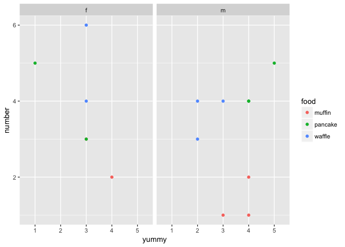

Homework 4
================
Kaitlyn Harper
October 5, 2017

-   [Part 1, Activity \#1 - Cheatsheet for dealing with messy data](#part-1-activity-1---cheatsheet-for-dealing-with-messy-data)
    -   [What's the deal with "messy data"?](#whats-the-deal-with-messy-data)
    -   [`Gather`](#gather)
    -   [Breakfast patterns](#breakfast-patterns)
    -   [Spread](#spread)
-   [Part 2, Activity](#part-2-activity)

``` r
library(tidyverse)
```

    ## Loading tidyverse: ggplot2
    ## Loading tidyverse: tibble
    ## Loading tidyverse: tidyr
    ## Loading tidyverse: readr
    ## Loading tidyverse: purrr
    ## Loading tidyverse: dplyr

    ## Conflicts with tidy packages ----------------------------------------------

    ## filter(): dplyr, stats
    ## lag():    dplyr, stats

``` r
library(knitr)
```

Part 1, Activity \#1 - Cheatsheet for dealing with messy data
-------------------------------------------------------------

Hi there! Welcome to my messy data cheatsheet. I got most of my information from [this](http://vita.had.co.nz/papers/tidy-data.pdf) paper, written by the one and only Hadley Wickham. He goes into a lot more detail and uses large data sets as examples, so definitely check it out if you find yourself itching for more information!

Okay then, let's get going!

### What's the deal with "messy data"?

Imagine this: You get to your office early one morning, keen to start your productive work day. The sun is shining, the birds are singing, and you're READY to explore that new data set your supervisor shared with you yesterday. Or so you think. As you sip your coffee, you open up the new data set in R and you see... this:

| subject | food    |    1|    2|    3|    4|    5|
|:--------|:--------|----:|----:|----:|----:|----:|
| Am      | muffin  |   NA|   NA|    1|   NA|   NA|
| Am      | pancake |   NA|   NA|   NA|    4|   NA|
| Am      | waffle  |   NA|   NA|    4|   NA|   NA|
| Bf      | muffin  |   NA|   NA|   NA|    2|   NA|
| Bf      | pancake |    5|   NA|   NA|   NA|   NA|
| Bf      | waffle  |   NA|   NA|    6|   NA|   NA|
| Cm      | muffin  |   NA|   NA|   NA|    1|   NA|
| Cm      | pancake |   NA|   NA|   NA|   NA|    5|
| Cm      | waffle  |   NA|    3|   NA|   NA|   NA|
| Df      | muffin  |   NA|   NA|    3|   NA|   NA|
| Df      | pancake |   NA|   NA|    3|   NA|   NA|
| Df      | waffle  |   NA|   NA|    4|   NA|   NA|
| Em      | muffin  |   NA|   NA|   NA|    2|   NA|
| Em      | pancake |   NA|   NA|   NA|    4|   NA|
| Em      | waffle  |   NA|    4|   NA|   NA|   NA|

This, my friends, is what we call messy data. Like, what is even going on here?? Oh wait- what's that? Ohhhh, luckily, there's a note on your desk with more information about the data! Unnnnluckily, it's in the handwriting of the first year undergrad that also works in your lab...

*"HI! I collected these data because I wanted to be helpful! The study is on what breakfast foods people like versus how much of that food they actually eat -- neat huh?? I designed it myself. I collected the data from five people in res!"*

You stop for a moment. 🙄 After taking a significant swig of coffee, you keep reading.

*"The subject variable has the code (A-E) for each individual, as well as their sex (binary-f/m). The food obviously refers to the breakfast food. Each of the other columns ("1"-"5") represent how "yummy" the subjects thought the foods were (1=awful; 5=awesome) and the values represent the number of servings they normally eat of that specific food during a meal. Anyway, thanks for analyzing it for me! Have fun!"*

Wow, yep, super fun. Thanks.

See, in a perfect world we would have beautiful data all the time, and analysing it would be a breeze. Unfortunately, we live in a world where Donald Trump became president of the United States (i.e. not perfect); thus, the data we're given isn't always clean and pristine.

There are **three things** that make data tidy, according to our good friend Hadley. Let's see if your data fit the criteria:
- Each variable forms a column. *Nope, nowhere in there do I see the "number of servings" variable*
- Each observation forms a row. *Okay, we're good with this one I think*
- Each type of observational unit forms a table. *Nope, we need to separate subject and sex*

Looks like we definitely have some cleaning to do. Alright, enough yabbering, get going on those analyses!

<a href="#top">Back to top</a>

### `Gather`

But what to do about these messy data? Doo-doo-DOO! :trumpet: Have no fear - `gather` is here! `Gather` is a really helpful function in the `tidyr` package that literally "gathers" up your data and collapses it into what are known as "key-value pairs". The `key` part takes each of the header (column) names that you specify and makes them into variables. The `value` part takes each of the messy values that are all spread out in the original "key" columns and **stacks them** on top of each other. Let's see it in action:

``` r
(clean_breakfast = gather(breakfast_messy, yummy, number, -c(subject, food)))
```

    ##    subject    food yummy number
    ## 1       Am  muffin     1     NA
    ## 2       Am pancake     1     NA
    ## 3       Am  waffle     1     NA
    ## 4       Bf  muffin     1     NA
    ## 5       Bf pancake     1      5
    ## 6       Bf  waffle     1     NA
    ## 7       Cm  muffin     1     NA
    ## 8       Cm pancake     1     NA
    ## 9       Cm  waffle     1     NA
    ## 10      Df  muffin     1     NA
    ## 11      Df pancake     1     NA
    ## 12      Df  waffle     1     NA
    ## 13      Em  muffin     1     NA
    ## 14      Em pancake     1     NA
    ## 15      Em  waffle     1     NA
    ## 16      Am  muffin     2     NA
    ## 17      Am pancake     2     NA
    ## 18      Am  waffle     2     NA
    ## 19      Bf  muffin     2     NA
    ## 20      Bf pancake     2     NA
    ## 21      Bf  waffle     2     NA
    ## 22      Cm  muffin     2     NA
    ## 23      Cm pancake     2     NA
    ## 24      Cm  waffle     2      3
    ## 25      Df  muffin     2     NA
    ## 26      Df pancake     2     NA
    ## 27      Df  waffle     2     NA
    ## 28      Em  muffin     2     NA
    ## 29      Em pancake     2     NA
    ## 30      Em  waffle     2      4
    ## 31      Am  muffin     3      1
    ## 32      Am pancake     3     NA
    ## 33      Am  waffle     3      4
    ## 34      Bf  muffin     3     NA
    ## 35      Bf pancake     3     NA
    ## 36      Bf  waffle     3      6
    ## 37      Cm  muffin     3     NA
    ## 38      Cm pancake     3     NA
    ## 39      Cm  waffle     3     NA
    ## 40      Df  muffin     3      3
    ## 41      Df pancake     3      3
    ## 42      Df  waffle     3      4
    ## 43      Em  muffin     3     NA
    ## 44      Em pancake     3     NA
    ## 45      Em  waffle     3     NA
    ## 46      Am  muffin     4     NA
    ## 47      Am pancake     4      4
    ## 48      Am  waffle     4     NA
    ## 49      Bf  muffin     4      2
    ## 50      Bf pancake     4     NA
    ## 51      Bf  waffle     4     NA
    ## 52      Cm  muffin     4      1
    ## 53      Cm pancake     4     NA
    ## 54      Cm  waffle     4     NA
    ## 55      Df  muffin     4     NA
    ## 56      Df pancake     4     NA
    ## 57      Df  waffle     4     NA
    ## 58      Em  muffin     4      2
    ## 59      Em pancake     4      4
    ## 60      Em  waffle     4     NA
    ## 61      Am  muffin     5     NA
    ## 62      Am pancake     5     NA
    ## 63      Am  waffle     5     NA
    ## 64      Bf  muffin     5     NA
    ## 65      Bf pancake     5     NA
    ## 66      Bf  waffle     5     NA
    ## 67      Cm  muffin     5     NA
    ## 68      Cm pancake     5      5
    ## 69      Cm  waffle     5     NA
    ## 70      Df  muffin     5     NA
    ## 71      Df pancake     5     NA
    ## 72      Df  waffle     5     NA
    ## 73      Em  muffin     5     NA
    ## 74      Em pancake     5     NA
    ## 75      Em  waffle     5     NA

``` r
# yummy = key: the name of the NEW column that will include each OLD column headers that became a variable
# number = value: the name of the NEW stacked-variable column
# 3:7 = "..." : the columns to include in the gathering (reshaping)
```

Notice that the 1-5 columns are gone. Those values are now stacked on top of each other in a new "yummy" column. Additionally, all those values from the original 1-5 columns were put in a single variable called "number" (remember it's the number of servings they normally eat). The bummer part about our data is that we have a bunch of NAs hanging around from our original data set, so our \*new and improved\* data frame still looks at bit messy. But hey, we can deal with that. Let's see what our dplyr functions can do for us:

``` r
clean_breakfast = 
  clean_breakfast %>% 
  na.omit() %>%                  # get rid of NAs
  arrange(subject, food) %>%     # arrange data set by subject 
  mutate(subject = substr(breakfast_messy$subject, start = 1, stop = 1),
         sex = substr(breakfast_messy$subject, start = 2, stop = 2)) %>% 
  
  # substr: breaks apart a string of characters
      # breakfast_messy$subject: variable to break apart
      # start = __: where to start the break
      # stop = __: where to end the break
  
  select(subject, sex, everything()) #rearrange the columns with sex toward the front (my personal preference)

knitr::kable(clean_breakfast)
```

| subject | sex | food    | yummy |  number|
|:--------|:----|:--------|:------|-------:|
| A       | m   | muffin  | 3     |       1|
| A       | m   | pancake | 4     |       4|
| A       | m   | waffle  | 3     |       4|
| B       | f   | muffin  | 4     |       2|
| B       | f   | pancake | 1     |       5|
| B       | f   | waffle  | 3     |       6|
| C       | m   | muffin  | 4     |       1|
| C       | m   | pancake | 5     |       5|
| C       | m   | waffle  | 2     |       3|
| D       | f   | muffin  | 3     |       3|
| D       | f   | pancake | 3     |       3|
| D       | f   | waffle  | 3     |       4|
| E       | m   | muffin  | 4     |       2|
| E       | m   | pancake | 4     |       4|
| E       | m   | waffle  | 2     |       4|

Oh dplyr, how I love thee :heart: But seriously, are you seeing this?! We now have a perfectly useful data set. Let's just quickly plot it and see if we can pick out any patterns!

<a href="#top">Back to top</a>

### Breakfast patterns

``` r
label_names = c("muffin"="Muffin", "pancake"="Pancake", "waffle" = "Waffle", "f"="Female", "m"="Male")

clean_breakfast %>% 
  ggplot(aes(x=subject, y=number)) +
  geom_bar(stat="identity", aes(fill=yummy)) +
  facet_grid(sex~food, labeller = as_labeller(label_names)) +
  labs(x="", y="Number of servings", title= "Number of servings of breakfast goodies")
```


``` r
clean_breakfast %>% 
  ggplot(aes(x=yummy, y=number))+
  geom_point(aes(color=food))+
  facet_wrap(~sex)
```



``` r
### figure out how to change size of points by size
```

Without doing any statistics (and given we have the world's smallest sample size), it's pretty hard to tell if any patterns emerge. Let's say we leave those biostats for a different day... or never...

<a href="#top">Back to top</a>

### Spread

While I have you here though, let's talk about the other helpful `tidyr` function: `spread`! Okay, so you cleaned your data set, but realized that you *actually* want to look more closely at the number of servings, grouped by yummy-ness (Note: this probably isn't the BEST example, since it's actually making the data messier, but it gets the point across).

``` r
breakfast_spread = breakfast %>% 
  spread(food, number, 0)

# food = key: the variable that you want broken down ("spread" out) into different columns 
# number = value: the values that will fill into your new columns
# 0 = fill: the default for this is NULL (nothing), but if you add it in, it'll fill in instead of NAs

kable(breakfast_spread)
```

| subject | sex |  yummy|  muffin|  pancake|  waffle|
|:--------|:----|------:|-------:|--------:|-------:|
| A       | m   |      3|       1|        0|       4|
| A       | m   |      4|       0|        4|       0|
| B       | f   |      1|       0|        5|       0|
| B       | f   |      3|       0|        0|       6|
| B       | f   |      4|       2|        0|       0|
| C       | m   |      2|       0|        0|       3|
| C       | m   |      4|       1|        0|       0|
| C       | m   |      5|       0|        5|       0|
| D       | f   |      3|       3|        3|       4|
| E       | m   |      2|       0|        0|       4|
| E       | m   |      4|       2|        4|       0|

So there you go! Both `gather` and `spread` are useful ways to tidy your data without getting a headache. Hooray for simple functions! Now who's hungry?? :pancakes:

<a href="#top">Back to top</a>

Part 2, Activity
----------------
