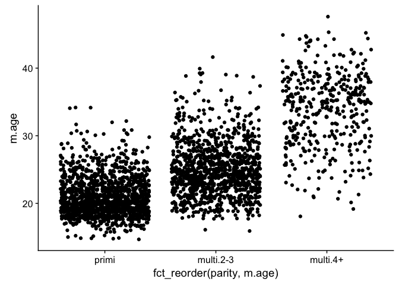

Homework 5
================
Kaitlyn Harper
October 18, 2017

-   [Introduction: zvitambo data set](#introduction-zvitambo-data-set)
-   [Factor management](#factor-management)
    -   [Change integer variables to factors](#change-integer-variables-to-factors)
    -   [Condense hospital visits](#condense-hospital-visits)
    -   [Count the entries in a factor](#count-the-entries-in-a-factor)
    -   [Reorder the levels of `idno` based on `zlen` variable](#reorder-the-levels-of-idno-based-on-zlen-variable)
    -   [Explore `arrange`](#explore-arrange)
-   [Write (and read) `small` df to file](#write-and-read-small-df-to-file)
-   [Visualization design](#visualization-design)
-   [Writing figures to file](#writing-figures-to-file)

Introduction: zvitambo data set
-------------------------------

Hi y'all!! Thanks for checking out my hw assignment \#5. For this assignment, I decided to branch out a bit and use a new data set. These data come from a big longitudinal study in Zimbabwe and looks at linear growth (height) of infants. In the chunk below, I'm going to use the`source` function to load the data set. Basically the `source` function finds another file (in this case, another R script) and runs it. I had to do some removing of sensitive information before using this data set for class, so I did all of that in another R script. Okie doke, let's take a look at what we've got!

``` r
suppressMessages(library(knitr))
library(forcats)
library(cowplot)
```

    ## Loading required package: ggplot2

    ## 
    ## Attaching package: 'cowplot'

    ## The following object is masked from 'package:ggplot2':
    ## 
    ##     ggsave

``` r
### Load data and packages
suppressMessages(source("/Users/kaitlynharper/Google Drive/UBC/Fall 2017/SPPH 501/SPPH501/Code/zvitambo_load.R"))
```

    ## Warning: package 'lme4' was built under R version 3.4.2

``` r
### Remove sensitive information and most variables
source("/Users/kaitlynharper/Google Drive/UBC/Fall 2017/STAT 545/STAT545-hw-harper-kaitlyn/hw05/data/clean_zvitambo_data.R")

glimpse(stunted)
```

    ## Observations: 17,568
    ## Variables: 12
    ## $ idno       <fctr> 10001C, 10001C, 10001C, 10001C, 10001C, 10001C, 10...
    ## $ age        <dbl> 0.03, 1.38, 3.03, 6.02, 9.24, 12.01, 14.38, 18.03, ...
    ## $ sex        <int> 2, 2, 2, 2, 2, 2, 2, 2, 2, 2, 2, 2, 2, 2, 2, 2, 2, ...
    ## $ zlen       <dbl> -1.5633183, -1.1393537, -1.3192434, -1.9059638, -2....
    ## $ a05        <fctr> norm vag, norm vag, norm vag, norm vag, norm vag, ...
    ## $ m.age      <int> 37, 37, 37, 37, 37, 37, 37, 37, 37, 18, 18, 18, 18,...
    ## $ noBF       <int> 0, 0, 0, 0, 0, 0, 0, 0, 0, 0, 0, 0, 0, 0, 0, 0, 0, ...
    ## $ lbw        <int> 0, 0, 0, 0, 0, 0, 0, 0, 0, 0, 0, 0, 0, 0, 0, 0, 0, ...
    ## $ term       <int> 1, 1, 1, 1, 1, 1, 1, 1, 1, 1, 1, 1, 1, 1, 1, 1, 1, ...
    ## $ parity     <fctr> multi.4+, multi.4+, multi.4+, multi.4+, multi.4+, ...
    ## $ stunt      <int> 0, 0, 0, 0, 1, 1, 1, 0, 0, 0, 0, 0, 1, 0, 0, 0, 0, ...
    ## $ c.visits.i <int> 0, 0, 0, 2, 0, 0, 1, 0, 1, 0, 1, 0, 1, 0, 0, 0, 1, ...

These variables can be a little confusing, so here's the metadata to help you out:

``` r
metadata = data.frame(variable = names(stunted),
                      interpretation = c("Subject ID", "Age", "Sex", "Height-for-age z-score",
                                         "Type of birth", "Mother's age at time of birth",
                                         "No breastfeeding (0=false, 1=true)", "Low birthweight (0=no)",
                                         "Born at term (0=no)", "Number of siblings", "Stunted growth (0=no)",
                                         "Number of visits to the hospital between measurements"))

kable(metadata)
```

| variable   | interpretation                                        |
|:-----------|:------------------------------------------------------|
| idno       | Subject ID                                            |
| age        | Age                                                   |
| sex        | Sex                                                   |
| zlen       | Height-for-age z-score                                |
| a05        | Type of birth                                         |
| m.age      | Mother's age at time of birth                         |
| noBF       | No breastfeeding (0=false, 1=true)                    |
| lbw        | Low birthweight (0=no)                                |
| term       | Born at term (0=no)                                   |
| parity     | Number of siblings                                    |
| stunt      | Stunted growth (0=no)                                 |
| c.visits.i | Number of visits to the hospital between measurements |

Just to clarify:
- There are ~3000 unique subject id's in this data set. Each individual was observed somewhere between 4-10 times over 0-24 months
- the main outcome here is the **height-for-age z-score** (`zlen`), a measure of how tall the baby is from 0-24 months. All you need to know is higher zlen = better, lower = worse. Basically all of the other variables are covariates that could influence growth.

<a href="#top">Back to top</a>

Factor management
-----------------

### Change integer variables to factors

There are a bunch of variables in this data set that need to be changed to factor. I'm going to do this by using the dplyr function `mutate_at` with the base `factor` argument. See below for a more detailed explanation!

``` r
### Make categorical vectors into factors

# columns of integers that need to be changed  
cols = c("sex", "noBF", "lbw", "term", "stunt", "c.visits.i")

# change integers to factors    
stunted = stunted %>% 
  mutate_at(cols, funs(factor(.)))

glimpse(stunted)
```

    ## Observations: 17,568
    ## Variables: 12
    ## $ idno       <fctr> 10001C, 10001C, 10001C, 10001C, 10001C, 10001C, 10...
    ## $ age        <dbl> 0.03, 1.38, 3.03, 6.02, 9.24, 12.01, 14.38, 18.03, ...
    ## $ sex        <fctr> 2, 2, 2, 2, 2, 2, 2, 2, 2, 2, 2, 2, 2, 2, 2, 2, 2,...
    ## $ zlen       <dbl> -1.5633183, -1.1393537, -1.3192434, -1.9059638, -2....
    ## $ a05        <fctr> norm vag, norm vag, norm vag, norm vag, norm vag, ...
    ## $ m.age      <int> 37, 37, 37, 37, 37, 37, 37, 37, 37, 18, 18, 18, 18,...
    ## $ noBF       <fctr> 0, 0, 0, 0, 0, 0, 0, 0, 0, 0, 0, 0, 0, 0, 0, 0, 0,...
    ## $ lbw        <fctr> 0, 0, 0, 0, 0, 0, 0, 0, 0, 0, 0, 0, 0, 0, 0, 0, 0,...
    ## $ term       <fctr> 1, 1, 1, 1, 1, 1, 1, 1, 1, 1, 1, 1, 1, 1, 1, 1, 1,...
    ## $ parity     <fctr> multi.4+, multi.4+, multi.4+, multi.4+, multi.4+, ...
    ## $ stunt      <fctr> 0, 0, 0, 0, 1, 1, 1, 0, 0, 0, 0, 0, 1, 0, 0, 0, 0,...
    ## $ c.visits.i <fctr> 0, 0, 0, 2, 0, 0, 1, 0, 1, 0, 1, 0, 1, 0, 0, 0, 1,...

``` r
rm(cols)
```

*Explanation:*
`mutate_at` is a helpful function that allows you to mutate multiple columns at the same time. Basically what I did was create a vector of column names (`cols`) for the variables that I want to change from integer to factor. Then I said, "hey stunted df, mutate *all* of these columns by changing them all to factors!" &lt;-- I did this using the `funs(factor(.))` argument. The `.` basically says, "do this function to all the columns you specified in the previous argument". I got the idea for this from [stack overflow](https://stackoverflow.com/questions/33180058/coerce-multiple-columns-to-factors-at-once).

Oh, also, that little `rm(cols)` function just gets rid of the new object (`cols`) that I created. I use this a ton just to keep my environment uncluttered, since in these hw assignments I tend to make a lot of new variables and it's hard to keep track of them all if they're all sitting there in the enviro.

I couldn't figure out how to use`forcats` to change multiple columns at once, but don't fret, I experiment with a few other `forcats` functions in the upcoming sections...

<a href="#top">Back to top</a>

### Condense hospital visits

The number of times an individual went to the hospital between each growth measurement was recorded in the `c.visits.i` variable. There was a pretty wide variety, as seen here:

``` r
table(stunted$c.visits.i)
```

    ## 
    ##     0     1     2     3     4     5     6     7     8    11 
    ## 12341  4202   832   147    30     8     3     3     1     1

As you can see, there were a lot of individuals who have between 0-2 visits, and then it tapers off toward the higher number of visits. I'm going to use `fct_lump` to condense the number of visits into just four categories: 0, 1, 2, and 3+.

``` r
stunted = stunted %>% 
  mutate(visits = fct_lump(c.visits.i, n = 3, other_level = "3+")) %>%
  select(-c.visits.i) # remove c.visits.i so we only have visits variable left

table(stunted$visits)
```

    ## 
    ##     0     1     2    3+ 
    ## 12341  4202   832   193

**Explanation:**
- `n=3` conserves only the top three categories and lumps everything else into the "other" category
- `other_level = "3+"` renames the other level to "3+" so that it doesn't just say "other"

<a href="#top">Back to top</a>

### Count the entries in a factor

To count how many entries you have in each level of a factor, you can use `fct_count`. In this example, I'm counting how many entries are in each level of "mother's age" (i.e. how old the mother was when the baby was born). First I'll change that variable into a factor, and then I'll create a new table showing only the levels and the number of entries.

``` r
mothersAge = stunted %>% 
  mutate(m.age.fact = factor(m.age)) #change m.age to factor

mothersAge = fct_count(mothersAge$m.age.fact, sort=TRUE) #Count how many entries are in each and SORT them in descending order

kable(head(mothersAge, 10)) #only showing the first 10 levels 
```

| f   |     n|
|:----|-----:|
| 19  |  1931|
| 20  |  1633|
| 21  |  1466|
| 22  |  1415|
| 24  |  1358|
| 23  |  1355|
| 18  |  1228|
| 25  |  1153|
| 26  |   966|
| 27  |   677|

``` r
rm(mothersAge) #clean up environment
```

It seems like `fct_count` is a nicer, cleaner version of the `table` function in base R (see below). It lets you put it in a nice format and arrange them in some sort of order. So while `table` is probably faster, `fct_count` seems handy when you want to present data in a specific way.

``` r
table(stunted$m.age)
```

    ## 
    ##   15   16   17   18   19   20   21   22   23   24   25   26   27   28   29 
    ##   56  105  326 1228 1931 1633 1466 1415 1355 1358 1153  966  677  535  469 
    ##   30   31   32   33   34   35   36   37   38   39   40   41   42   43   44 
    ##  485  266  223  261  215  307  196  196  181  197   94   62   55   28   47 
    ##   45   48 
    ##   30    6

<a href="#top">Back to top</a>

### Reorder the levels of `idno` based on `zlen` variable

In this example I'll reorder the subject ID entries based on a continuous variable (zlen). Check out the explanation below for more info.

``` r
low_zlen_factor = fct_reorder(stunted$idno, stunted$zlen, min) %>% 
  levels() %>% 
  head()

lowest = stunted %>% 
  filter(idno %in% low_zlen_factor) %>%         # Keep only the id numbers in low_zlen_factor
  group_by(idno) %>%
  filter(zlen == min(zlen)) %>%                 # Keep only the lowest of the zlen
  select(idno, zlen)                            # Select these two variables for easy viewing

kable(lowest)
```

| idno   |       zlen|
|:-------|----------:|
| 10836G |  -5.987512|
| 14697P |  -5.901554|
| 15368N |  -5.935273|
| 16774Z |  -5.889528|
| 17891D |  -5.889036|
| 19226C |  -5.901901|

``` r
rm(lowest, low_zlen_factor) # clean up environment
```

**Explanation:**
`fct_reorder` allows you to reorder the levels of a factor (first argument: `stunted$idno`) based on a different variable (second argument: `stunted$zlen`), using a specific function (third argument:`min`). I chose to use `min` for the function because it seemed the most applicable; I can now easily see which subjects have the worst growth patterns, AND make nice plots from it!

<a href="#top">Back to top</a>

### Explore `arrange`

**Does merely arranging the data have any effect on a figure?**
In order to illustrate this point, I'm going to reduce the data frame down to only one measurement per individual. To do this, I'm going to only keep the minimum height (zlen) value for each individual and drop the others.

``` r
### Create reduced data frame
small = stunted %>% 
  group_by(idno) %>% 
  filter(zlen == min(zlen))

head(small)
```

    ## # A tibble: 6 x 12
    ## # Groups:   idno [6]
    ##     idno   age    sex      zlen      a05 m.age   noBF    lbw   term
    ##   <fctr> <dbl> <fctr>     <dbl>   <fctr> <int> <fctr> <fctr> <fctr>
    ## 1 10001C 12.01      2 -2.526537 norm vag    37      0      0      1
    ## 2 10004N  6.02      2 -2.077990 norm vag    18      0      0      1
    ## 3 10012N 12.40      1 -2.590719 norm vag    18      1      0      1
    ## 4 10026X  5.82      1 -3.101916 norm vag    21      0      1      1
    ## 5 10028A  5.95      1 -2.121231 norm vag    28      0      0      1
    ## 6 10032D 24.05      2 -2.116569 norm vag    31      0      0      1
    ## # ... with 3 more variables: parity <fctr>, stunt <fctr>, visits <fctr>

``` r
small %>% 
  na.omit() %>% 
  arrange(parity) %>% 
  head()
```

    ## # A tibble: 6 x 12
    ## # Groups:   idno [6]
    ##     idno   age    sex      zlen      a05 m.age   noBF    lbw   term
    ##   <fctr> <dbl> <fctr>     <dbl>   <fctr> <int> <fctr> <fctr> <fctr>
    ## 1 10026X  5.82      1 -3.101916 norm vag    21      0      1      1
    ## 2 10032D 24.05      2 -2.116569 norm vag    31      0      0      1
    ## 3 10034X  0.03      1 -2.406671 norm vag    22      0      0      1
    ## 4 10035C 21.22      1 -2.187292 norm vag    27      0      0      1
    ## 5 10066D 23.09      2 -2.353991 norm vag    20      0      0      1
    ## 6 10081F  0.00      1 -2.051761 norm vag    29      1      0      1
    ## # ... with 3 more variables: parity <fctr>, stunt <fctr>, visits <fctr>

``` r
small %>% 
  na.omit() %>% 
  arrange(parity) %>% 
  ggplot(aes(x=parity, y=m.age)) +
  geom_jitter()
```


``` r
small %>% 
  na.omit() %>% 
  arrange(parity) %>% 
ggplot(aes(x = fct_reorder(parity, m.age), y = m.age)) +
  geom_jitter()
```


<a href="#top">Back to top</a>

Write (and read) `small` df to file
-----------------------------------

``` r
# write to file
write.csv(small,"/Users/kaitlynharper/Google Drive/UBC/Fall 2017/STAT 545/STAT545-hw-harper-kaitlyn/hw05/data/stunted_small.csv")

rm(small)

small.1 = read.csv("/Users/kaitlynharper/Google Drive/UBC/Fall 2017/STAT 545/STAT545-hw-harper-kaitlyn/hw05/data/stunted_small.csv", header=T)

kable(head(small.1))
```

|    X| idno   |    age|  sex|       zlen| a05      |  m.age|  noBF|  lbw|  term| parity    |  stunt| visits |
|----:|:-------|------:|----:|----------:|:---------|------:|-----:|----:|-----:|:----------|------:|:-------|
|    1| 10001C |  12.01|    2|  -2.526537| norm vag |     37|     0|    0|     1| multi.4+  |      1| 0      |
|    2| 10004N |   6.02|    2|  -2.077990| norm vag |     18|     0|    0|     1| primi     |      1| 1      |
|    3| 10012N |  12.40|    1|  -2.590719| norm vag |     18|     1|    0|     1| primi     |      1| 1      |
|    4| 10026X |   5.82|    1|  -3.101916| norm vag |     21|     0|    1|     1| multi.2-3 |      1| 0      |
|    5| 10028A |   5.95|    1|  -2.121231| norm vag |     28|     0|    0|     1| multi.4+  |      1| 0      |
|    6| 10032D |  24.05|    2|  -2.116569| norm vag |     31|     0|    0|     1| multi.2-3 |      1| 1      |

``` r
small.2 = read.csv("/Users/kaitlynharper/Google Drive/UBC/Fall 2017/STAT 545/STAT545-hw-harper-kaitlyn/hw05/data/stunted_small.csv", header=T, row.names = 1)

kable(head(small.2))
```

| idno   |    age|  sex|       zlen| a05      |  m.age|  noBF|  lbw|  term| parity    |  stunt| visits |
|:-------|------:|----:|----------:|:---------|------:|-----:|----:|-----:|:----------|------:|:-------|
| 10001C |  12.01|    2|  -2.526537| norm vag |     37|     0|    0|     1| multi.4+  |      1| 0      |
| 10004N |   6.02|    2|  -2.077990| norm vag |     18|     0|    0|     1| primi     |      1| 1      |
| 10012N |  12.40|    1|  -2.590719| norm vag |     18|     1|    0|     1| primi     |      1| 1      |
| 10026X |   5.82|    1|  -3.101916| norm vag |     21|     0|    1|     1| multi.2-3 |      1| 0      |
| 10028A |   5.95|    1|  -2.121231| norm vag |     28|     0|    0|     1| multi.4+  |      1| 0      |
| 10032D |  24.05|    2|  -2.116569| norm vag |     31|     0|    0|     1| multi.2-3 |      1| 1      |

``` r
rm(small.1)
```

<a href="#top">Back to top</a>

Visualization design
--------------------

``` r
### function to plot random samples

 make_random_samples = function(df) {
  
  ### plot 16 random individuals
  IDsample = df[sample(nrow(df), 16), 1]
  
  # Create small data set with only the 16 IDsamples
  random_sample = 
    df %>% 
    filter(idno %in% IDsample)
 }
```

``` r
  my_colors = c("darkmagenta", "forestgreen") #define colours to be used in the plot  

  random_recovered = make_random_samples(stunted %>% filter(parity=="primi"))
  
  (primi = random_recovered %>% 
    filter(!is.na(zlen)) %>% 
    ggplot(aes(age, zlen, color = factor(sex, labels = c("Female", "Male")))) +
    geom_point(na.rm=T) +
    geom_line(na.rm=T) +
    geom_hline(yintercept=-2, linetype="dashed", color="darkgrey", size = 1) +
    facet_wrap(~idno) + 
    labs(x = "Age (months)", y = "Height-for-age z-score (HAZ)", 
         title = "Growth of firstborn infants in first 12-24 months") +
    scale_colour_manual(values = my_colors, name = "Sex"))
```



Writing figures to file
-----------------------

``` r
  (parity.bar = stunted %>% 
      group_by(idno) %>% 
      slice(1) %>% 
      na.omit() %>% 
      ggplot(aes(x = factor(sex, labels = c("Female", "Male")), fill = parity)) +
      geom_bar() + 
  labs(x = "Sex", title = "Number of individuals born with siblings, by sex"))
```


``` r
ggsave("/Users/kaitlynharper/Google Drive/UBC/Fall 2017/STAT 545/STAT545-hw-harper-kaitlyn/hw05/paritybar.pdf", plot = parity.bar,
       width = 5, height = 5)

ggsave("/Users/kaitlynharper/Google Drive/UBC/Fall 2017/STAT 545/STAT545-hw-harper-kaitlyn/hw05/paritybar2.pdf", plot = parity.bar)
```

    ## Saving 7 x 5 in image


