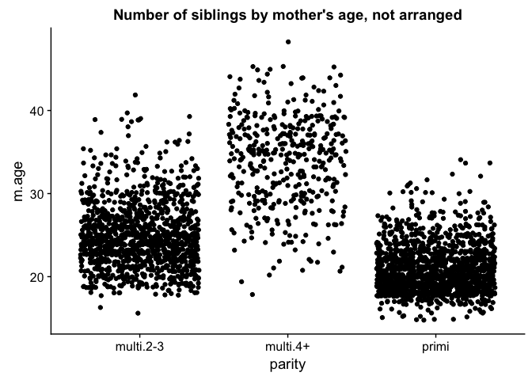
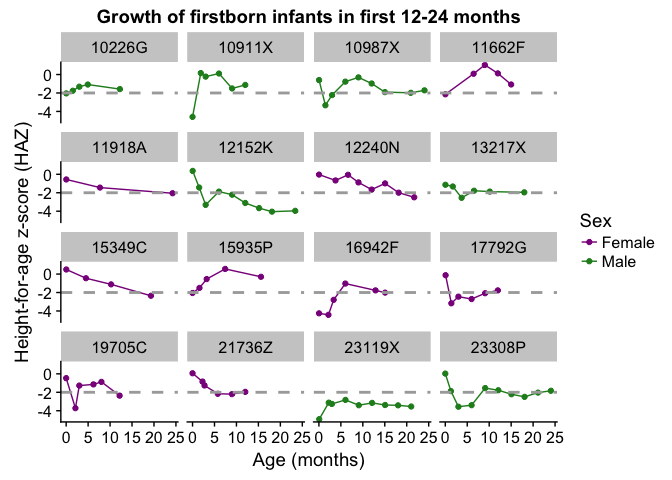
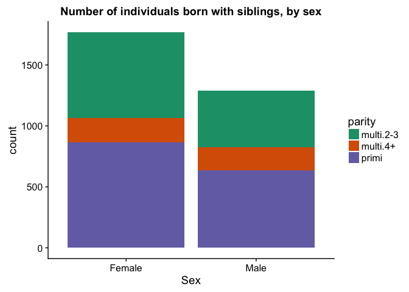

Homework 5
================
Kaitlyn Harper
October 18, 2017

-   [Introduction: zvitambo data set](#introduction-zvitambo-data-set)
-   [Factor management](#factor-management)
    -   [Change integer variables to factors (required)](#change-integer-variables-to-factors-required)
    -   [Drop factor levels (required)](#drop-factor-levels-required)
    -   [Condense hospital visits (extra)](#condense-hospital-visits-extra)
    -   [Count the entries in a factor (extra)](#count-the-entries-in-a-factor-extra)
    -   [Reorder the levels of `idno` based on `zlen` variable (required)](#reorder-the-levels-of-idno-based-on-zlen-variable-required)
    -   [Explore `arrange` (required)](#explore-arrange-required)
-   [Write (and read) `small` df to file](#write-and-read-small-df-to-file)
-   [Visualization design](#visualization-design)
-   [Writing figures to file](#writing-figures-to-file)
-   [Reflection](#reflection)

Introduction: zvitambo data set
-------------------------------

Hi y'all!! Thanks for checking out my hw assignment \#5. For this assignment, I decided to branch out a bit and use a new data set. These data come from a big longitudinal study in Zimbabwe and looks at linear growth (height) of infants. In the chunk below, I'm going to use the`source` function to load the data set. Basically the `source` function finds another file (in this case, another R script) and runs it. I had to do some removing of sensitive information before using this data set for class, so I did all of that in another R script. Okie doke, let's take a look at what we've got!

``` r
suppressMessages(library(knitr))
library(forcats)
library(cowplot)
```

    ## Loading required package: ggplot2

    ## 
    ## Attaching package: 'cowplot'

    ## The following object is masked from 'package:ggplot2':
    ## 
    ##     ggsave

``` r
library(RColorBrewer)

### Load data and packages
suppressMessages(source("/Users/kaitlynharper/Google Drive/UBC/Fall 2017/SPPH 501/SPPH501/Code/zvitambo_load.R"))
```

    ## Warning: package 'lme4' was built under R version 3.4.2

``` r
### Remove sensitive information and most variables
source("/Users/kaitlynharper/Google Drive/UBC/Fall 2017/STAT 545/STAT545-hw-harper-kaitlyn/hw05/data/clean_zvitambo_data.R")

glimpse(stunted)
```

    ## Observations: 17,568
    ## Variables: 12
    ## $ idno       <fctr> 10001C, 10001C, 10001C, 10001C, 10001C, 10001C, 10...
    ## $ age        <dbl> 0.03, 1.38, 3.03, 6.02, 9.24, 12.01, 14.38, 18.03, ...
    ## $ sex        <int> 2, 2, 2, 2, 2, 2, 2, 2, 2, 2, 2, 2, 2, 2, 2, 2, 2, ...
    ## $ zlen       <dbl> -1.5633183, -1.1393537, -1.3192434, -1.9059638, -2....
    ## $ a05        <fctr> norm vag, norm vag, norm vag, norm vag, norm vag, ...
    ## $ m.age      <int> 37, 37, 37, 37, 37, 37, 37, 37, 37, 18, 18, 18, 18,...
    ## $ noBF       <int> 0, 0, 0, 0, 0, 0, 0, 0, 0, 0, 0, 0, 0, 0, 0, 0, 0, ...
    ## $ lbw        <int> 0, 0, 0, 0, 0, 0, 0, 0, 0, 0, 0, 0, 0, 0, 0, 0, 0, ...
    ## $ term       <int> 1, 1, 1, 1, 1, 1, 1, 1, 1, 1, 1, 1, 1, 1, 1, 1, 1, ...
    ## $ parity     <fctr> multi.4+, multi.4+, multi.4+, multi.4+, multi.4+, ...
    ## $ stunt      <int> 0, 0, 0, 0, 1, 1, 1, 0, 0, 0, 0, 0, 1, 0, 0, 0, 0, ...
    ## $ c.visits.i <int> 0, 0, 0, 2, 0, 0, 1, 0, 1, 0, 1, 0, 1, 0, 0, 0, 1, ...

These variables can be a little confusing, so here's the metadata to help you out:

``` r
metadata = data.frame(variable = names(stunted),
                      interpretation = c("Subject ID", "Age", "Sex", "Height-for-age z-score",
                                         "Type of birth", "Mother's age at time of birth",
                                         "No breastfeeding (0=false, 1=true)", "Low birthweight (0=no)",
                                         "Born at term (0=no)", "Number of siblings", "Stunted growth (0=no)",
                                         "Number of visits to the hospital between measurements"))

kable(metadata)
```

| variable   | interpretation                                        |
|:-----------|:------------------------------------------------------|
| idno       | Subject ID                                            |
| age        | Age                                                   |
| sex        | Sex                                                   |
| zlen       | Height-for-age z-score                                |
| a05        | Type of birth                                         |
| m.age      | Mother's age at time of birth                         |
| noBF       | No breastfeeding (0=false, 1=true)                    |
| lbw        | Low birthweight (0=no)                                |
| term       | Born at term (0=no)                                   |
| parity     | Number of siblings                                    |
| stunt      | Stunted growth (0=no)                                 |
| c.visits.i | Number of visits to the hospital between measurements |

Just to clarify:
- There are ~3000 unique subject id's in this data set. Each individual was observed somewhere between 4-10 times over 0-24 months
- the main outcome here is the **height-for-age z-score** (`zlen`), a measure of how tall the baby is from 0-24 months. All you need to know is higher zlen = better, lower = worse. Basically all of the other variables are covariates that could influence growth.

<a href="#top">Back to top</a>

Factor management
-----------------

### Change integer variables to factors (required)

There are a bunch of variables in this data set that need to be changed to factor. I'm going to do this by using the dplyr function `mutate_at` with the base `factor` argument. See below for a more detailed explanation!

``` r
### Make categorical vectors into factors

# columns of integers that need to be changed  
cols = c("sex", "noBF", "lbw", "term", "stunt", "c.visits.i")

# change integers to factors    
stunted = stunted %>% 
  mutate_at(cols, funs(factor(.)))

glimpse(stunted)
```

    ## Observations: 17,568
    ## Variables: 12
    ## $ idno       <fctr> 10001C, 10001C, 10001C, 10001C, 10001C, 10001C, 10...
    ## $ age        <dbl> 0.03, 1.38, 3.03, 6.02, 9.24, 12.01, 14.38, 18.03, ...
    ## $ sex        <fctr> 2, 2, 2, 2, 2, 2, 2, 2, 2, 2, 2, 2, 2, 2, 2, 2, 2,...
    ## $ zlen       <dbl> -1.5633183, -1.1393537, -1.3192434, -1.9059638, -2....
    ## $ a05        <fctr> norm vag, norm vag, norm vag, norm vag, norm vag, ...
    ## $ m.age      <int> 37, 37, 37, 37, 37, 37, 37, 37, 37, 18, 18, 18, 18,...
    ## $ noBF       <fctr> 0, 0, 0, 0, 0, 0, 0, 0, 0, 0, 0, 0, 0, 0, 0, 0, 0,...
    ## $ lbw        <fctr> 0, 0, 0, 0, 0, 0, 0, 0, 0, 0, 0, 0, 0, 0, 0, 0, 0,...
    ## $ term       <fctr> 1, 1, 1, 1, 1, 1, 1, 1, 1, 1, 1, 1, 1, 1, 1, 1, 1,...
    ## $ parity     <fctr> multi.4+, multi.4+, multi.4+, multi.4+, multi.4+, ...
    ## $ stunt      <fctr> 0, 0, 0, 0, 1, 1, 1, 0, 0, 0, 0, 0, 1, 0, 0, 0, 0,...
    ## $ c.visits.i <fctr> 0, 0, 0, 2, 0, 0, 1, 0, 1, 0, 1, 0, 1, 0, 0, 0, 1,...

``` r
rm(cols)
```

*Explanation:*
`mutate_at` is a helpful function that allows you to mutate multiple columns at the same time. Basically what I did was create a vector of column names (`cols`) for the variables that I want to change from integer to factor. Then I said, "hey stunted df, mutate *all* of these columns by changing them all to factors!" &lt;-- I did this using the `funs(factor(.))` argument. The `.` basically says, "do this function to all the columns you specified in the previous argument". I got the idea for this from [stack overflow](https://stackoverflow.com/questions/33180058/coerce-multiple-columns-to-factors-at-once).

Oh, also, that little `rm(cols)` function just gets rid of the new object (`cols`) that I created. I use this a ton just to keep my environment uncluttered, since in these hw assignments I tend to make a lot of new variables and it's hard to keep track of them all if they're all sitting there in the enviro.

I couldn't figure out how to use`forcats` to change multiple columns at once, but don't fret, I experiment with a few other `forcats` functions in the upcoming sections...

<a href="#top">Back to top</a>

### Drop factor levels (required)

Within this data set, there is a "type of birth" variable (a05) that has 6 different levels:

``` r
levels(stunted$a05)
```

    ## [1] "breech vag" "el-csect"   "em-csect"   "forceps"    "norm vag"  
    ## [6] "vaccuum"

However, not all of these levels are used in the data set. Check it out:

``` r
table(stunted$a05)
```

    ## 
    ## breech vag   el-csect   em-csect    forceps   norm vag    vaccuum 
    ##        280        424       1008          0      15477        189

Fortunately, `fct_drop` can help us get rid of the pesky "forceps" level so we're left only with the five useful levels.

``` r
stunted$a05 = fct_drop(stunted$a05) #remove unused levels

levels(stunted$a05) #check levels
```

    ## [1] "breech vag" "el-csect"   "em-csect"   "norm vag"   "vaccuum"

Voila! Easy peasy. Now we have only the levels we need!

<a href="#top">Back to top</a>

### Condense hospital visits (extra)

The number of times an individual went to the hospital between each growth measurement was recorded in the `c.visits.i` variable. There was a pretty wide variety, as seen here:

``` r
table(stunted$c.visits.i)
```

    ## 
    ##     0     1     2     3     4     5     6     7     8    11 
    ## 12341  4202   832   147    30     8     3     3     1     1

As you can see, there were a lot of individuals who have between 0-2 visits, and then it tapers off toward the higher number of visits. I'm going to use `fct_lump` to condense the number of visits into just four categories: 0, 1, 2, and 3+.

``` r
stunted = stunted %>% 
  mutate(visits = fct_lump(c.visits.i, n = 3, other_level = "3+")) %>%
  select(-c.visits.i) # remove c.visits.i so we only have visits variable left

table(stunted$visits)
```

    ## 
    ##     0     1     2    3+ 
    ## 12341  4202   832   193

**Explanation:**
- `n=3` conserves only the top three categories and lumps everything else into the "other" category
- `other_level = "3+"` renames the other level to "3+" so that it doesn't just say "other"

<a href="#top">Back to top</a>

### Count the entries in a factor (extra)

To count how many entries you have in each level of a factor, you can use `fct_count`. In this example, I'm counting how many entries are in each level of "mother's age" (i.e. how old the mother was when the baby was born). First I'll change that variable into a factor, and then I'll create a new table showing only the levels and the number of entries.

``` r
mothersAge = stunted %>% 
  mutate(m.age.fact = factor(m.age)) #change m.age to factor

mothersAge = fct_count(mothersAge$m.age.fact, sort=TRUE) #Count how many entries are in each and SORT them in descending order

kable(head(mothersAge, 10)) #only showing the first 10 levels 
```

| f   |     n|
|:----|-----:|
| 19  |  1931|
| 20  |  1633|
| 21  |  1466|
| 22  |  1415|
| 24  |  1358|
| 23  |  1355|
| 18  |  1228|
| 25  |  1153|
| 26  |   966|
| 27  |   677|

``` r
rm(mothersAge) #clean up environment
```

It seems like `fct_count` is a nicer, cleaner version of the `table` function in base R (see below). It lets you put it in a nice format and arrange them in some sort of order. So while `table` is probably faster, `fct_count` seems handy when you want to present data in a specific way.

``` r
table(stunted$m.age)
```

    ## 
    ##   15   16   17   18   19   20   21   22   23   24   25   26   27   28   29 
    ##   56  105  326 1228 1931 1633 1466 1415 1355 1358 1153  966  677  535  469 
    ##   30   31   32   33   34   35   36   37   38   39   40   41   42   43   44 
    ##  485  266  223  261  215  307  196  196  181  197   94   62   55   28   47 
    ##   45   48 
    ##   30    6

<a href="#top">Back to top</a>

### Reorder the levels of `idno` based on `zlen` variable (required)

In this example I'll reorder the subject ID entries based on a continuous variable (zlen). Check out the explanation below for more info.

``` r
low_zlen_factor = fct_reorder(stunted$idno, stunted$zlen, min) %>% 
  levels() %>% 
  head()

lowest = stunted %>% 
  filter(idno %in% low_zlen_factor) %>%         # Keep only the id numbers in low_zlen_factor
  group_by(idno) %>%
  filter(zlen == min(zlen)) %>%                 # Keep only the lowest of the zlen
  select(idno, zlen)                            # Select these two variables for easy viewing

kable(lowest)
```

| idno   |       zlen|
|:-------|----------:|
| 10836G |  -5.987512|
| 14697P |  -5.901554|
| 15368N |  -5.935273|
| 16774Z |  -5.889528|
| 17891D |  -5.889036|
| 19226C |  -5.901901|

``` r
rm(lowest, low_zlen_factor) # clean up environment
```

**Explanation:**
`fct_reorder` allows you to reorder the levels of a factor (first argument: `stunted$idno`) based on a different variable (second argument: `stunted$zlen`), using a specific function (third argument:`min`). I chose to use `min` for the function because it seemed the most applicable; I can now easily see which subjects have the worst growth patterns, AND make nice plots from it!

<a href="#top">Back to top</a>

### Explore `arrange` (required)

**Does merely arranging the data have any effect on a figure?**
In order to illustrate this point, I'm going to reduce the data frame down to only one measurement per individual. To do this, I'm going to only keep the minimum height (zlen) value for each individual and drop the others. Then I'm going to plot parity (number of siblings) versus mother's age.

``` r
### Create reduced data frame
small = stunted %>% 
  group_by(idno) %>% 
  filter(zlen == min(zlen))

### Plot the data (no arranging)
small %>% 
  na.omit() %>% 
  ggplot(aes(x=parity, y=m.age)) +
  geom_jitter() +
  ggtitle("Number of siblings by mother's age, not arranged")
```



Alright, now let's look at what `arrange` does when you plot it:

``` r
# Arrange and view data (head)
small %>%       
  na.omit() %>%              # remove NAs
  arrange(parity) %>%        # arrange by parity levels
  select(idno, parity) %>%   # select only the idno and parity (for viewing purposes)
  head()                     # view new data set, arranged by parity levels
```

    ## # A tibble: 6 x 2
    ## # Groups:   idno [6]
    ##     idno    parity
    ##   <fctr>    <fctr>
    ## 1 10026X multi.2-3
    ## 2 10032D multi.2-3
    ## 3 10034X multi.2-3
    ## 4 10035C multi.2-3
    ## 5 10066D multi.2-3
    ## 6 10081F multi.2-3

``` r
# Plot arranged data
small %>% 
  na.omit() %>% 
  arrange(parity) %>% 
  ggplot(aes(x=parity, y=m.age)) +
  geom_jitter() +
  ggtitle("Number of siblings by mother's age, arranged")
```


So you can see that even though the data are arranged now, it doesn't really do anything to the plot. Let's see what happens when you actually relevel the factors based on a different variable:

``` r
small %>% 
  na.omit() %>% 
  arrange(parity) %>% 
ggplot(aes(x = fct_reorder(parity, m.age), y = m.age)) +
  geom_jitter()
```


Ahh, much nicer. This just goes to show that releveling the factors can make our plots look more organized! This gets at what Tamara was talking about in her lecture as well - I can see how if you have many different factors, it would be helpful to relevel them in order to organize them in a way that makes the plot easier to read.

<a href="#top">Back to top</a>

Write (and read) `small` df to file
-----------------------------------

In this section, I'm going to take my `small` data frame that I made and write it into a new csv file. Then I'm going to read that csv back into my Rmd.

``` r
# write to file
write.csv(small,"/Users/kaitlynharper/Google Drive/UBC/Fall 2017/STAT 545/STAT545-hw-harper-kaitlyn/hw05/data/stunted_small.csv")

small.1 = read.csv("/Users/kaitlynharper/Google Drive/UBC/Fall 2017/STAT 545/STAT545-hw-harper-kaitlyn/hw05/data/stunted_small.csv", header=T)

kable(head(small), format = "html", caption = "Original df")
```

<table>
<caption>
Original df
</caption>
<thead>
<tr>
<th style="text-align:left;">
idno
</th>
<th style="text-align:right;">
age
</th>
<th style="text-align:left;">
sex
</th>
<th style="text-align:right;">
zlen
</th>
<th style="text-align:left;">
a05
</th>
<th style="text-align:right;">
m.age
</th>
<th style="text-align:left;">
noBF
</th>
<th style="text-align:left;">
lbw
</th>
<th style="text-align:left;">
term
</th>
<th style="text-align:left;">
parity
</th>
<th style="text-align:left;">
stunt
</th>
<th style="text-align:left;">
visits
</th>
</tr>
</thead>
<tbody>
<tr>
<td style="text-align:left;">
10001C
</td>
<td style="text-align:right;">
12.01
</td>
<td style="text-align:left;">
2
</td>
<td style="text-align:right;">
-2.526537
</td>
<td style="text-align:left;">
norm vag
</td>
<td style="text-align:right;">
37
</td>
<td style="text-align:left;">
0
</td>
<td style="text-align:left;">
0
</td>
<td style="text-align:left;">
1
</td>
<td style="text-align:left;">
multi.4+
</td>
<td style="text-align:left;">
1
</td>
<td style="text-align:left;">
0
</td>
</tr>
<tr>
<td style="text-align:left;">
10004N
</td>
<td style="text-align:right;">
6.02
</td>
<td style="text-align:left;">
2
</td>
<td style="text-align:right;">
-2.077990
</td>
<td style="text-align:left;">
norm vag
</td>
<td style="text-align:right;">
18
</td>
<td style="text-align:left;">
0
</td>
<td style="text-align:left;">
0
</td>
<td style="text-align:left;">
1
</td>
<td style="text-align:left;">
primi
</td>
<td style="text-align:left;">
1
</td>
<td style="text-align:left;">
1
</td>
</tr>
<tr>
<td style="text-align:left;">
10012N
</td>
<td style="text-align:right;">
12.40
</td>
<td style="text-align:left;">
1
</td>
<td style="text-align:right;">
-2.590719
</td>
<td style="text-align:left;">
norm vag
</td>
<td style="text-align:right;">
18
</td>
<td style="text-align:left;">
1
</td>
<td style="text-align:left;">
0
</td>
<td style="text-align:left;">
1
</td>
<td style="text-align:left;">
primi
</td>
<td style="text-align:left;">
1
</td>
<td style="text-align:left;">
1
</td>
</tr>
<tr>
<td style="text-align:left;">
10026X
</td>
<td style="text-align:right;">
5.82
</td>
<td style="text-align:left;">
1
</td>
<td style="text-align:right;">
-3.101916
</td>
<td style="text-align:left;">
norm vag
</td>
<td style="text-align:right;">
21
</td>
<td style="text-align:left;">
0
</td>
<td style="text-align:left;">
1
</td>
<td style="text-align:left;">
1
</td>
<td style="text-align:left;">
multi.2-3
</td>
<td style="text-align:left;">
1
</td>
<td style="text-align:left;">
0
</td>
</tr>
<tr>
<td style="text-align:left;">
10028A
</td>
<td style="text-align:right;">
5.95
</td>
<td style="text-align:left;">
1
</td>
<td style="text-align:right;">
-2.121231
</td>
<td style="text-align:left;">
norm vag
</td>
<td style="text-align:right;">
28
</td>
<td style="text-align:left;">
0
</td>
<td style="text-align:left;">
0
</td>
<td style="text-align:left;">
1
</td>
<td style="text-align:left;">
multi.4+
</td>
<td style="text-align:left;">
1
</td>
<td style="text-align:left;">
0
</td>
</tr>
<tr>
<td style="text-align:left;">
10032D
</td>
<td style="text-align:right;">
24.05
</td>
<td style="text-align:left;">
2
</td>
<td style="text-align:right;">
-2.116569
</td>
<td style="text-align:left;">
norm vag
</td>
<td style="text-align:right;">
31
</td>
<td style="text-align:left;">
0
</td>
<td style="text-align:left;">
0
</td>
<td style="text-align:left;">
1
</td>
<td style="text-align:left;">
multi.2-3
</td>
<td style="text-align:left;">
1
</td>
<td style="text-align:left;">
1
</td>
</tr>
</tbody>
</table>
``` r
kable(head(small.1), format = "html", caption = "Newly written df")
```

<table>
<caption>
Newly written df
</caption>
<thead>
<tr>
<th style="text-align:right;">
X
</th>
<th style="text-align:left;">
idno
</th>
<th style="text-align:right;">
age
</th>
<th style="text-align:right;">
sex
</th>
<th style="text-align:right;">
zlen
</th>
<th style="text-align:left;">
a05
</th>
<th style="text-align:right;">
m.age
</th>
<th style="text-align:right;">
noBF
</th>
<th style="text-align:right;">
lbw
</th>
<th style="text-align:right;">
term
</th>
<th style="text-align:left;">
parity
</th>
<th style="text-align:right;">
stunt
</th>
<th style="text-align:left;">
visits
</th>
</tr>
</thead>
<tbody>
<tr>
<td style="text-align:right;">
1
</td>
<td style="text-align:left;">
10001C
</td>
<td style="text-align:right;">
12.01
</td>
<td style="text-align:right;">
2
</td>
<td style="text-align:right;">
-2.526537
</td>
<td style="text-align:left;">
norm vag
</td>
<td style="text-align:right;">
37
</td>
<td style="text-align:right;">
0
</td>
<td style="text-align:right;">
0
</td>
<td style="text-align:right;">
1
</td>
<td style="text-align:left;">
multi.4+
</td>
<td style="text-align:right;">
1
</td>
<td style="text-align:left;">
0
</td>
</tr>
<tr>
<td style="text-align:right;">
2
</td>
<td style="text-align:left;">
10004N
</td>
<td style="text-align:right;">
6.02
</td>
<td style="text-align:right;">
2
</td>
<td style="text-align:right;">
-2.077990
</td>
<td style="text-align:left;">
norm vag
</td>
<td style="text-align:right;">
18
</td>
<td style="text-align:right;">
0
</td>
<td style="text-align:right;">
0
</td>
<td style="text-align:right;">
1
</td>
<td style="text-align:left;">
primi
</td>
<td style="text-align:right;">
1
</td>
<td style="text-align:left;">
1
</td>
</tr>
<tr>
<td style="text-align:right;">
3
</td>
<td style="text-align:left;">
10012N
</td>
<td style="text-align:right;">
12.40
</td>
<td style="text-align:right;">
1
</td>
<td style="text-align:right;">
-2.590719
</td>
<td style="text-align:left;">
norm vag
</td>
<td style="text-align:right;">
18
</td>
<td style="text-align:right;">
1
</td>
<td style="text-align:right;">
0
</td>
<td style="text-align:right;">
1
</td>
<td style="text-align:left;">
primi
</td>
<td style="text-align:right;">
1
</td>
<td style="text-align:left;">
1
</td>
</tr>
<tr>
<td style="text-align:right;">
4
</td>
<td style="text-align:left;">
10026X
</td>
<td style="text-align:right;">
5.82
</td>
<td style="text-align:right;">
1
</td>
<td style="text-align:right;">
-3.101916
</td>
<td style="text-align:left;">
norm vag
</td>
<td style="text-align:right;">
21
</td>
<td style="text-align:right;">
0
</td>
<td style="text-align:right;">
1
</td>
<td style="text-align:right;">
1
</td>
<td style="text-align:left;">
multi.2-3
</td>
<td style="text-align:right;">
1
</td>
<td style="text-align:left;">
0
</td>
</tr>
<tr>
<td style="text-align:right;">
5
</td>
<td style="text-align:left;">
10028A
</td>
<td style="text-align:right;">
5.95
</td>
<td style="text-align:right;">
1
</td>
<td style="text-align:right;">
-2.121231
</td>
<td style="text-align:left;">
norm vag
</td>
<td style="text-align:right;">
28
</td>
<td style="text-align:right;">
0
</td>
<td style="text-align:right;">
0
</td>
<td style="text-align:right;">
1
</td>
<td style="text-align:left;">
multi.4+
</td>
<td style="text-align:right;">
1
</td>
<td style="text-align:left;">
0
</td>
</tr>
<tr>
<td style="text-align:right;">
6
</td>
<td style="text-align:left;">
10032D
</td>
<td style="text-align:right;">
24.05
</td>
<td style="text-align:right;">
2
</td>
<td style="text-align:right;">
-2.116569
</td>
<td style="text-align:left;">
norm vag
</td>
<td style="text-align:right;">
31
</td>
<td style="text-align:right;">
0
</td>
<td style="text-align:right;">
0
</td>
<td style="text-align:right;">
1
</td>
<td style="text-align:left;">
multi.2-3
</td>
<td style="text-align:right;">
1
</td>
<td style="text-align:left;">
1
</td>
</tr>
</tbody>
</table>
Uh oh! Something's weird about the new df I wrote in. That's because I'm missing a key argument: `row.names`. This argument is used if your row names get saved as a new column. `row.names=1` will take the **first** column and turn it into your row names (`row.names=2` will take the **second** column, etc.)

``` r
small.2 = read.csv("/Users/kaitlynharper/Google Drive/UBC/Fall 2017/STAT 545/STAT545-hw-harper-kaitlyn/hw05/data/stunted_small.csv", header=T, row.names = 1)

kable(head(small.2), format = "html", caption = "FIXED newly written df")
```

<table>
<caption>
FIXED newly written df
</caption>
<thead>
<tr>
<th style="text-align:left;">
idno
</th>
<th style="text-align:right;">
age
</th>
<th style="text-align:right;">
sex
</th>
<th style="text-align:right;">
zlen
</th>
<th style="text-align:left;">
a05
</th>
<th style="text-align:right;">
m.age
</th>
<th style="text-align:right;">
noBF
</th>
<th style="text-align:right;">
lbw
</th>
<th style="text-align:right;">
term
</th>
<th style="text-align:left;">
parity
</th>
<th style="text-align:right;">
stunt
</th>
<th style="text-align:left;">
visits
</th>
</tr>
</thead>
<tbody>
<tr>
<td style="text-align:left;">
10001C
</td>
<td style="text-align:right;">
12.01
</td>
<td style="text-align:right;">
2
</td>
<td style="text-align:right;">
-2.526537
</td>
<td style="text-align:left;">
norm vag
</td>
<td style="text-align:right;">
37
</td>
<td style="text-align:right;">
0
</td>
<td style="text-align:right;">
0
</td>
<td style="text-align:right;">
1
</td>
<td style="text-align:left;">
multi.4+
</td>
<td style="text-align:right;">
1
</td>
<td style="text-align:left;">
0
</td>
</tr>
<tr>
<td style="text-align:left;">
10004N
</td>
<td style="text-align:right;">
6.02
</td>
<td style="text-align:right;">
2
</td>
<td style="text-align:right;">
-2.077990
</td>
<td style="text-align:left;">
norm vag
</td>
<td style="text-align:right;">
18
</td>
<td style="text-align:right;">
0
</td>
<td style="text-align:right;">
0
</td>
<td style="text-align:right;">
1
</td>
<td style="text-align:left;">
primi
</td>
<td style="text-align:right;">
1
</td>
<td style="text-align:left;">
1
</td>
</tr>
<tr>
<td style="text-align:left;">
10012N
</td>
<td style="text-align:right;">
12.40
</td>
<td style="text-align:right;">
1
</td>
<td style="text-align:right;">
-2.590719
</td>
<td style="text-align:left;">
norm vag
</td>
<td style="text-align:right;">
18
</td>
<td style="text-align:right;">
1
</td>
<td style="text-align:right;">
0
</td>
<td style="text-align:right;">
1
</td>
<td style="text-align:left;">
primi
</td>
<td style="text-align:right;">
1
</td>
<td style="text-align:left;">
1
</td>
</tr>
<tr>
<td style="text-align:left;">
10026X
</td>
<td style="text-align:right;">
5.82
</td>
<td style="text-align:right;">
1
</td>
<td style="text-align:right;">
-3.101916
</td>
<td style="text-align:left;">
norm vag
</td>
<td style="text-align:right;">
21
</td>
<td style="text-align:right;">
0
</td>
<td style="text-align:right;">
1
</td>
<td style="text-align:right;">
1
</td>
<td style="text-align:left;">
multi.2-3
</td>
<td style="text-align:right;">
1
</td>
<td style="text-align:left;">
0
</td>
</tr>
<tr>
<td style="text-align:left;">
10028A
</td>
<td style="text-align:right;">
5.95
</td>
<td style="text-align:right;">
1
</td>
<td style="text-align:right;">
-2.121231
</td>
<td style="text-align:left;">
norm vag
</td>
<td style="text-align:right;">
28
</td>
<td style="text-align:right;">
0
</td>
<td style="text-align:right;">
0
</td>
<td style="text-align:right;">
1
</td>
<td style="text-align:left;">
multi.4+
</td>
<td style="text-align:right;">
1
</td>
<td style="text-align:left;">
0
</td>
</tr>
<tr>
<td style="text-align:left;">
10032D
</td>
<td style="text-align:right;">
24.05
</td>
<td style="text-align:right;">
2
</td>
<td style="text-align:right;">
-2.116569
</td>
<td style="text-align:left;">
norm vag
</td>
<td style="text-align:right;">
31
</td>
<td style="text-align:right;">
0
</td>
<td style="text-align:right;">
0
</td>
<td style="text-align:right;">
1
</td>
<td style="text-align:left;">
multi.2-3
</td>
<td style="text-align:right;">
1
</td>
<td style="text-align:left;">
1
</td>
</tr>
</tbody>
</table>
``` r
rm(small.1)
```

K great! We've successfully wrote and read a file to and from R! Hooray! :tada:

<a href="#top">Back to top</a>

Visualization design
--------------------

Alright, lastly let's make a nice looking plot that uses some of the features that Tamara talked about in her lecture. BUT FIRST, let's attempt to make a function!

``` r
### function to plot random samples

 make_random_samples = function(df) {
  
  ### plot 16 random individuals
  IDsample = df[sample(nrow(df), 16), 1]
  
  # Create small data set with only the 16 IDsamples
  random_sample = 
    df %>% 
    filter(idno %in% IDsample)
 }
```

OoOoOoOo yayyyy it worked! 👍 Since this is covered in 547 I'm not going to go into a TON of detail, but I'll give you at least a little outline of what I did:

-   assigned the function a name (`make_random_samples`)
-   Created a new variable (`IDsample`) that took a random sample of `16` individuals from all the rows (`nrow(df)`) in the first column (`1`) in my data frame using the `sample` function. The reason why it says `df` is so that I'll know that I can stick any data frame in this function in the future and the function will work.
-   Lastly, I created a new df called `random_sample` that only contains the ID numbers (`idno`) in the new `IDsample` variable.

So I know this wasn't the most informative explanation, but hopefully it'll give the gist of what I did. So next I'll this function and apply it to the `stunted` data frame. Then I'll filter out only the individuals that have no siblings (i.e. "primi" individuals) and plot their growth over time.

``` r
  my_colors = c("darkmagenta", "forestgreen") #define colours to be used in the plot  

  random_recovered = make_random_samples(stunted %>% filter(parity=="primi"))
  
  (primi = random_recovered %>% 
    filter(!is.na(zlen)) %>% 
    ggplot(aes(age, zlen, color = factor(sex, labels = c("Female", "Male")))) +
    geom_point(na.rm=T) +
    geom_line(na.rm=T) +
    geom_hline(yintercept=-2, linetype="dashed", color="darkgrey", size = 1) +
    facet_wrap(~idno) + 
    labs(x = "Age (months)", y = "Height-for-age z-score (HAZ)", 
         title = "Growth of firstborn infants in first 12-24 months") +
    scale_colour_manual(values = my_colors, name = "Sex"))
```



Cool! I tried to apply some of Tamara's principles in this plot, including connecting the dots (not just doing geom\_point) to make the connection more clear over time. I also used two distinct colours to show the difference between males and females. There were lots of other variables I could have put into the plot, but I tried to limit it so that our puny human minds wouldn't get all jumbled up in its complexity :wink:

<a href="#top">Back to top</a>

Writing figures to file
-----------------------

Lastly, I made one more simple plot and saved it as a pdf using `cowplot`'s `ggsave` function.

``` r
  (parity.bar = stunted %>% 
      group_by(idno) %>% 
      slice(1) %>% 
      na.omit() %>% 
      ggplot(aes(x = factor(sex, labels = c("Female", "Male")), fill = parity)) +
      geom_bar() + 
  labs(x = "Sex", title = "Number of individuals born with siblings, by sex")) + 
  scale_fill_manual(values=brewer.pal(n=3, "Dark2"))
```



``` r
ggsave("/Users/kaitlynharper/Google Drive/UBC/Fall 2017/STAT 545/STAT545-hw-harper-kaitlyn/hw05/hw05_files/figure-markdown_github-ascii_identifiers/paritybar.pdf", plot = parity.bar,
       width = 5, height = 5)

ggsave("/Users/kaitlynharper/Google Drive/UBC/Fall 2017/STAT 545/STAT545-hw-harper-kaitlyn/hw05/hw05_files/figure-markdown_github-ascii_identifiers/paritybar2.pdf", plot = parity.bar)
```

    ## Saving 7 x 5 in image


I experimented with changing the size of the plot, and it seems like the smaller your dimensions, the bigger everything shows up, which is good to know. I'm not *exactly* sure this^ is how it was supposed to end up when we embedded them into our md, but it's kind of cool!

<a href="#top">Back to top</a>

Reflection
----------

Whew! This assignment was a doozy for me! I felt like navigating all the functions in `forcats` was difficult. I mostly used the [cran.r-project pdf](https://cran.r-project.org/web/packages/forcats/forcats.pdf) for information on each of the specific functions, which helped a lot. I enjoyed looking at a new set of data, even though I found it to be harder to adapt all of the various tasks to a data set that I don't know quite as well as the gapminder set (I know, I know, I *could have* used the gapminder set... I was just trying to give myself a challenge!!!) I also tried to experiment with some things like writing functions, which I've always heard were really helpful but haven't really tried doing myself. I used the links from the [stat 547 page](http://stat545.com/cm102_writing-functions.html) to help me out with that (since I sadly won't be able to continue on with 547 :cry:) Writing the figures and df to files didn't seem like a big issue to me. The biggest problem is that I moved some stuff around manually (i.e. created a new folder and put the files into it), which I later realized was a really bad idea. I had to go back and change a bunch of my pathways so that things would run properly again. One thing I want to continue working on in the future is using the different colour schemes presented in class. I looked up the R color names and used those, but only used Color Brewer once (which turned out nicely, if I do say so myself). Anyway, thanks for making it through the whole assignment and happy end-of-stat545!

Cheers!
